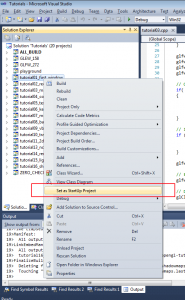
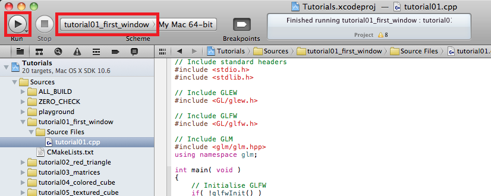
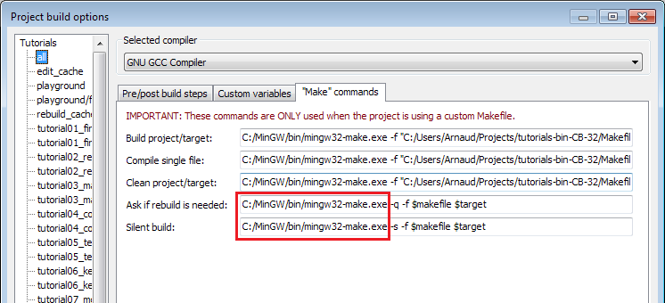

<style>
  h3 {
    margin: 20px 0px 10px 0px;
  }
</style>

##Tutorial 1: Opening a window
##第一课： 新建一个窗口

###Introduction
Welcome to the first tutorial !

Before jumping into OpenGL, you will first learn how to build the code that goes with each tutorial, how to run it, and most importantly, how to play with the code yourself.

###Prerequisites
No special prerequisite is needed to follow these tutorials. Experience with any programming langage ( C, Java, Lisp, Javascript, whatever ) is better to fully understand the code, but not needed ;
it will merely be more complicated to learn two things at the same time.

All tutorials are written in “Easy C++” : Lots of effort has been made to make the code as simple as possible. No templates, no classes, no pointers.
This way, you will be able to understand everything even if you only know Java.

###Forget Everything
You don’t have to know anything, but you have to forget everything you know about OpenGL.
If you know about something that looks like glBegin(), forget it. Here you will learn modern OpenGL (OpenGL 3 and 4) , and most online tutorials teach “old” OpenGL (OpenGL 1 and 2).
So forget everything you might know before your brain melts from the mix.

###Building the tutorials
All tutorials can be built on Windows, Linux and Mac. For all these platforms, the procedure is roughly the same :

update your drivers !! doooo it. You’ve been warned.
Download a compiler, if you don’t already have one.
Install CMake
Download the source code of the tutorials
Generate a project using CMake
Build the project
Play with the samples !
Detailed procedures will now be given for each platform. Adaptations may be required. If unsure, read the instruction for Windows and try to adapt them.

####Building on Windows
1.Updating your drivers shoud be easy. Just go to NVIDIA’s or AMD’s website and download the drivers. If unsure about your GPU model : Control Panel -> System and Security -> System -> Device Manager -> Display adapter. If you have an integrated Intel GPU, drivers are usually provided by your OEM (Dell, HP, …).

2.We suggest using Visual Studio 2010 Express as a compiler. You can download it for free here. If you prefer using MinGW, we recommend using Qt Creator. Install whichever you want. Subsequent steps will be explained with Visual Studio, but should be similar with any other IDE.

3.Download CMake from here and install it

4.Download the source code and unzip it, for instance in C:\Users\XYZ\Projects\OpenGLTutorials\ .

5.Launch CMake. In the first line, navigate to the unzipped folder. If unsure, choose the folder that contains the CMakeLists.txt file. In the second line, enter where you want all the compiler’s stuff to live. For instance, you can choose C:\Users\XYZ\Projects\OpenGLTutorials-build-Visual2010-32bits\, or C:\Users\XYZ\Projects\OpenGLTutorials\build\Visual2010-32bits\. Notice that it can be anywhere, not necessarily in the same folder.


6.Click on the Configure button. Since this is the first time you configure the project, CMake will ask you which compiler you would like to use. Choose wisely depending on step 1. If you have a 64 bit Windows, you can choose 64 bits; if you don’t know, choose 32 bits.

7.Click on Configure until all red lines disappear. Click on Generate. Your Visual Studio project is now created. You can forget about CMake; uninstall it if you want.
Open C:\Users\XYZ\Projects\OpenGLTutorials-build-Visual2010-32bits\. You will see a Tutorials.sln file : open it with Visual Studio.


In the Build menu, click Build All. Every tutorial and dependency will be compiled. Each executable will also be copied back into C:\Users\XYZ\Projects\OpenGLTutorials\ . Hopefuly no error occurs.


9. Open C:\Users\XYZ\Projects\OpenGLTutorials\playground, and launch playground.exe. A black window should appear.


You can also launch any tutorial from inside Visual Studio, but you will need to setup the Working Directory first : right-click on Playground, go to Properties, choose Debugging, Working Directory, Browse, and navigate to C:\Users\XYZ\Projects\OpenGLTutorials\playground\. Validate. Right-click on Playground once again, “Choose as startup project”. You can now debug the code by pressing F5.




###Building on Linux
They are so many Linux variants out there that it’s impossible to list every possible platform. Adapt if required, and don’t hesitate to read your distribution’s documentation.

1.Install the latest drivers. We highly recommend the closed-source binary drivers. It’s not GNU or whatever, but they work. If your distribution doesn’t provide an automatic install, try Ubuntu’s guide.

2.Install all needed compilers, tools & libs. Complete list is : cmake make g++ libx11-dev libgl1-mesa-dev libglu1-mesa-dev libxrandr-dev libxext-dev . Use sudo apt-get install ***** or su && yum install ******.

3.Download the source code and unzip it, for instance in ~/Projects/OpenGLTutorials/

4.cd in ~/Projects/OpenGLTutorials/ and enter the following commands :
mkdir build
cd build
cmake ..

5.A makefile has been created in the build/ directory.

6.type “make all”. Every tutorial and dependency will be compiled. Each executable will also be copied back into ~/Projects/OpenGLTutorials/ . Hopefuly no error occurs.

7.Open ~/Projects/OpenGLTutorials/playground, and launch ./playground. A black window should appear.

Note that you really should use an IDE like Qt Creator. In particular, this one has built-in support for CMake, and it will provide a much nicer experience when debugging. Here are the instructions for QtCreator :

1.In QtCreator, go to File->Tools->Options->Compile&Execute->CMake

2.Set the path to CMake. This is most probably /usr/bin/cmake

3.File->Open Project; Select tutorials/CMakeLists.txt

4.Select a build directory, preferably outside the tutorials folder

5.Optionally set -DCMAKE_BUILD_TYPE=Debug in the parameters box. Validate.

6.Click on the hammer on the bottom. The tutorials can now be launched from the tutorials/ folder.

7.To run the tutorials from QtCreator, click on Projects->Execution parameters->Working Directory, and select the directory where the shaders, textures & models live. Example for tutorial 2 : ~/opengl-tutorial/tutorial02_red_triangle/


###Building on Mac
Mac OS doesn’t support OpenGL 3.3. Recent Macs with MacOS 10.7 Lion and compatible GPUs can run OpenGL 3.2, but not 3.3. Use the 2.1 port of the tutorials instead. Apart from that, the procedure is very similar to Windows’ (Makefiles are also supported, but won’t be explained here) :

1.Install XCode from the Mac App Store

2.Download CMake, and install the .dmg . You don’t need to install the command-line tools.

3.Download the source code (VERSION 2.1 !!) and unzip it, for instance in ~/Projects/OpenGLTutorials/ .

4.Launch CMake (Applications->CMake). In the first line, navigate to the unzipped folder. If unsure, choose the folder that contains the CMakeLists.txt file. In the second line, enter where you want all the compiler’s stuff to live. For instance, you can choose ~/Projects/OpenGLTutorials_bin_XCode/. Notice that it can be anywhere, not necessarily in the same folder.

5.Click on the Configure button. Since this is the first time you configure the project, CMake will ask you which compiler you would like to use. Choose Xcode.

6.Click on Configure until all red lines disappear. Click on Generate. Your Xcode project is now created. You can forget about CMake; uninstall it if you want.

7.Open ~/Projects/OpenGLTutorials_bin_XCode/ . You will see a Tutorials.xcodeproj file : open it.

8.Select the desired tutorial to run in Xcode’s Scheme panel, and use the Run button to compile & run :



##Note for Code::Blocks
Due to 2 bugs (one in C::B, one in CMake), you have to edit the command-line in Project->Build Options->Make commands, as follows :



You also have to setup the working directory yourself : Project->Properties -> Build targets -> tutorial N -> execution working dir ( it’s src_dir/tutorial_N/ ).

##Running the tutorials
You should run the tutorials directly from the right directory : simply double-click on the executable. If you like command line best, cd to the right directory.

If you want to run the tutorials from the IDE, don’t forget to read the instructions above to set the correct working directory.

##How to follow these tutorials
Each tutorial comes with its source code and data, which can be found in tutorialXX/. However, you will never modify these projects : they are for reference only. Open playground/playground.cpp, and tweak this file instead. Torture it in any way you like. If you are lost, simply cut’n paste any tutorial in it, and everything should be back to normal.

We will provide snippets of code all along the tutorials. Don’t hesitate to cut’n paste them directly in the playground while you’re reading : experimentation is good. Avoid simply reading the finished code, you won’t learn a lot this way. Even with simple cut’n pasting, you’ll get your boatload of problems.

##Opening a window
Finally ! OpenGL code !
Well, not really. All tutorials show you the “low level” way to do things, so that you can see that no magic happens. But this part is actually very boring and useless, so we will use GLFW, an external library, to do this for us instead. If you really wanted to, you could use the Win32 API on Windows, the X11 API on Linux, and the Cocoa API on Mac; or use another library like SFML, FreeGLUT, SDL, … see the Links page.

Ok, let’s go. First, we’ll have to deal with dependencies : we need some basic stuff to display messages in the console :

```
// Include standard headers
#include <stdio.h>
#include <stdlib.h>
```

First, GLEW. So this one actually is a little bit magic, but let’s leave this for later.

```
// Include GLEW. Always include it before gl.h and glfw.h, since it's a bit magic.
#include <GL/glew.h>
```

We decided to let GLFW handle the window and the keyboard, so let’s include it too :

```
// Include GLFW
#include <GL/glfw.h>
```

We don’t actually need this one right now, but this is a library for 3D mathematics. It will prove very useful soon. There is no magic in GLM, you can write your own if you want; it’s just handy. The “using namespace” is there to avoid typing “glm::vec3″, but “vec3″ instead.

```
// Include GLM
#include <glm/glm.hpp>
using namespace glm;
```

If you cut’n paste all these #include’s in playground.cpp, the compiler will complain that there is no main() function. So let’s create one :

```
int main(){
```

First thing to do it to initialize GLFW :

```
// Initialise GLFW
if( !glfwInit() )
{
    fprintf( stderr, "Failed to initialize GLFW\n" );
    return -1;
}
```

We can now create our first OpenGL window !

```
glfwOpenWindowHint(GLFW_FSAA_SAMPLES, 4); // 4x antialiasing
glfwOpenWindowHint(GLFW_OPENGL_VERSION_MAJOR, 3); // We want OpenGL 3.3
glfwOpenWindowHint(GLFW_OPENGL_VERSION_MINOR, 3);
glfwOpenWindowHint(GLFW_OPENGL_PROFILE, GLFW_OPENGL_CORE_PROFILE); //We don't want the old OpenGL
 
// Open a window and create its OpenGL context
if( !glfwOpenWindow( 1024, 768, 0,0,0,0, 32,0, GLFW_WINDOW ) )
{
    fprintf( stderr, "Failed to open GLFW window\n" );
    glfwTerminate();
    return -1;
}
 
// Initialize GLEW
glewExperimental=true; // Needed in core profile
if (glewInit() != GLEW_OK) {
    fprintf(stderr, "Failed to initialize GLEW\n");
    return -1;
}
 
glfwSetWindowTitle( "Tutorial 01" );
```

Build this and run. A window should appear, and be closed right away. Of course ! We need to wait until the user hits the Escape key :

```
// Ensure we can capture the escape key being pressed below
glfwEnable( GLFW_STICKY_KEYS );
 
do{
    // Draw nothing, see you in tutorial 2 !
 
    // Swap buffers
    glfwSwapBuffers();
 
} // Check if the ESC key was pressed or the window was closed
while( glfwGetKey( GLFW_KEY_ESC ) != GLFW_PRESS &&
glfwGetWindowParam( GLFW_OPENED ) );
```

And this concludes our first tutorial ! In Tutorial 2, you will learn how to actually draw a triangle.

