<style>
  h3 {
	margin: 20px 0px 10px 0px;
  }
</style>

免责申明（必读！）：本网站提供的所有教程的翻译原稿均来自于互联网，仅供学习交流之用，切勿进行商业传播。同时，转载时不要移除本申明。如产生任何纠纷，均与本博客所有人、发表该翻译稿之人无任何关系。谢谢合作！

原文链接：http://www.opengl-tutorial.org/beginners-tutorials/tutorial-3-matrices/

##第三课： 矩阵

引擎完全没有推动飞船。飞船静止在原处，而引擎推动了环绕着飞船的宇宙。

*《飞出个未来》(一部美国科幻动画片)*

`这一课是所有课程中最重要的。请至少看八遍。`

###齐次坐标（Homogeneous coordinates）

目前为止，我们仍然把三维顶点视为三元组(x, y, z)。现在引入一个新的分量w，得到向量(x, y, z, w)。

请先记住以下两点（稍后我们会给出解释）：

若w==1，则向量(x, y, z, 1)为空间中的点。

若w==0，则向量(x, y, z, 0)为方向。

`（事实上，要永远记着。）`

这有什么不同呢？对于旋转，二者没什么不同。当你旋转点和方向时，结果是一样的。但对于平移（将点沿着某个方向移动），情况就不同了。『平移一个方向』是毫无意义的。

齐次坐标使我们能用同一个公式对点和方向作运算。

###变换矩阵（Transformation matrices）

####矩阵简介

简而言之，矩阵就是一个行、列数固定的，纵横排列的数表。比如，一个2×3矩阵看起来像这样：


三维图形学中我们只用到4×4矩阵，它能对顶点(x, y, z, w)作变换。这一变换是用矩阵左乘顶点来实现的：

矩阵x顶点（记住顺序！！矩阵左乘顶点，顶点用列向量表示）= 变换后的顶点


这看上去复杂，实则不然。左手指着a，右手指着x，得到ax。 左手移向右边一个数b，右手移向下一个数y，得到by。依次类推，得到cz、dw。最后求和ax + by + cz + dw，就得到了新的x！每一行都这么算下去，就得到了新的(x, y, z, w)向量。

这种重复无聊的计算就让计算机代劳吧。

**用C++，GLM表示：**

```cpp
glm::mat4 myMatrix;
glm::vec4 myVector;
// fill myMatrix and myVector somehow
glm::vec4 transformedVector = myMatrix * myVector; // Again, in this order ! this is important.
```

**用GLSL表示：**

```cpp
mat4 myMatrix;
vec4 myVector;
// fill myMatrix and myVector somehow
vec4 transformedVector = myMatrix * myVector; // Yeah, it's pretty much the same than GLM
```

`（还没把这些复制到你的代码里跑跑吗？赶紧试试！）`

####平移矩阵（Translation matrices）

平移矩阵是最简单易懂的变换矩阵。平移矩阵是这样的：


其中，X、Y、Z是点的位移增量。

例如，若想把向量(10, 10, 10, 1)沿X轴方向平移10个单位，可得：


`（算算看！一定要动手算算！！）`

这样就得到了齐次向量(20, 10, 10, 1)！记住，末尾的1表示这是一个点，而不是方向。经过变换计算后，点仍然是点，很合理。

下面来看看，对一个代表Z轴负方向的向量，作上述平移变换会得到什么结果：


即还是原来的(0, 0, -1, 0)方向，这也很合理，正好印证了前面的结论：“平移一个方向是毫无意义的”。

那怎么用代码表示平移变换呢？

**用C++，GLM表示：**

```cpp
#include <glm/transform.hpp> // after <glm/glm.hpp>

glm::mat4 myMatrix = glm::translate(10,0,0);
glm::vec4 myVector(10,10,10,0);
glm::vec4 transformedVector = myMatrix * myVector; // guess the result
```

**用GLSL表示：**呃，实际中我们几乎不用GLSL做。大多数情况下在C++代码中用glm::translate()算出矩阵，然后把它传给GLSL。在GLSL中只做一次乘法：

```cpp
vec4 transformedVector = myMatrix * myVector;
```

####单位矩阵（Identity matrix）

单位矩阵很特殊，它什么也不做。我提到它是因为，知道它和知道A*1.0=A一样重要。


用C++表示：

```cpp
glm::mat4 myIdentityMatrix = glm::mat4(1.0);
```

####缩放矩阵（Scaling matrices）

缩放矩阵也很简单：


例如把一个向量（点或方向皆可）沿各方向放大2倍：


w还是没变。你也许会问：“缩放一个向量”有什么用？嗯，大多数情况下是没什么用，所以一般不会去做；但在某些罕见情况下它就有用了。（顺便说一下，单位矩阵只是缩放矩阵的一个特例，其(X, Y, Z) = (1, 1, 1)。单位矩阵同时也是旋转矩阵的一个特例，其(X, Y, Z)=(0, 0, 0)）。

**用C++表示：**

```cpp
// Use #include <glm/gtc/matrix_transform.hpp> and #include <glm/gtx/transform.hpp>
glm::mat4 myScalingMatrix = glm::scale(2,2,2);
```

####旋转矩阵（Rotation matrices）

旋转矩阵比较复杂。这里略过细节，因为日常应用中，你并不需要知道矩阵的内部构造。
想了解更多，请看[矩阵和四元组常见问题](http://www.cs.princeton.edu/~gewang/projects/darth/stuff/quat_faq.html)（这个资源很热门，应该有中文版吧）。

**用C++表示：**

```cpp
// Use #include <glm/gtc/matrix_transform.hpp> and #include <glm/gtx/transform.hpp>
glm::vec3 myRotationAxis( ??, ??, ??);
glm::rotate( angle_in_degrees, myRotationAxis );
```

####复合变换

前面已经学习了如何旋转、平移和缩放向量。要是能将它们组合起来就更好了。只需把这些矩阵相乘即可，例如：

```cpp
TransformedVector = TranslationMatrix * RotationMatrix * ScaleMatrix * OriginalVector;
```

！！！千万注意！！！这行代码最先执行缩放，接着旋转，最后才是平移。这就是矩阵乘法的工作方式。

变换的顺序不同，得出的结果也不同。体验一下：
- 向前一步（小心别磕着爱机）然后左转；
- 左转，然后向前一步

实际上，上述顺序正是你在变换游戏人物或者其他物体时所需的：先缩放；再调整方向；最后平移。例如，假设有个船的模型（为简化，略去旋转）：

`错误做法：`
- 按(10, 0, 0)平移船体。船体中心目前距离原点10个单位。

- 将船体放大2倍。以原点为参照，每个坐标都变成原来的2倍，就出问题了。……最后你是得到一艘放大的船，但
其中心位于2*10=20。这可不是你想要的结果。

`正确做法：`
- 将船体放大2倍，得到一艘中心位于原点的大船。

- 平移船体。船大小不变，移动距离也正确。

矩阵-矩阵乘法和矩阵-向量乘法类似，所以这里也会省略一些细节，不清楚的请移步“矩阵和四元数常见问题”。现在，就让计算机来算：

**用C++，GLM表示：**

```cpp
glm::mat4 myModelMatrix = myTranslationMatrix * myRotationMatrix * myScaleMatrix;
glm::vec4 myTransformedVector = myModelMatrix * myOriginalVector;
```

**用GLSL表示：**

```cpp
mat4 transform = mat2 * mat1;
vec4 out_vec = transform * in_vec;
```

###模型（Model）、视图（View）和投影（Projection）矩阵

*在接下来的课程中，我们假定已知绘制Blender经典三维模型：小猴Suzanne的方法。*

利用模型、视图和投影矩阵，可以将变换过程清晰地分解为三个阶段。这个方法你可以不用（我们在前两课就没用），但最好要用。我们即将看到，它们把整个流程划分得很清楚，故被广为使用。

####模型矩阵

这个三维模型，和我们心爱的红色三角形一样，是由一组顶点定义的。顶点的XYZ坐标是相对于物体中心定义的：也就是说，若某顶点位于(0, 0, 0)，它就在物体的中心。

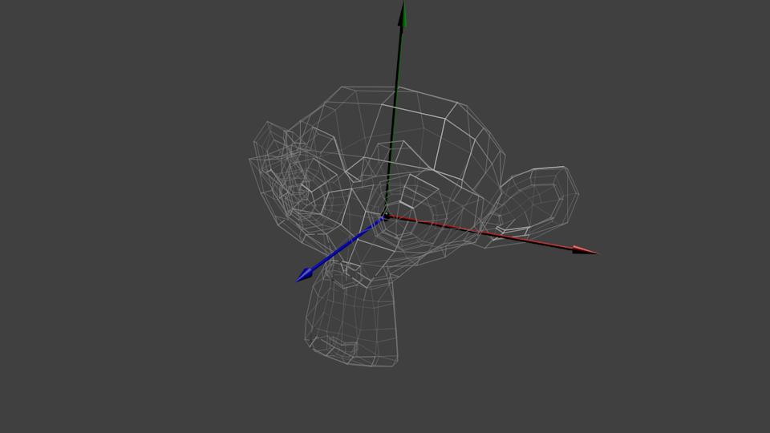

也许玩家需要用键鼠控制这个模型，所以我们希望能够移动它。这简单，只需学会：缩放*旋转*平移就行了。在每一帧中，用算出的这个矩阵，去乘（在GLSL中乘，不是C++中！）所有的顶点，物体就动了。唯一不动的就是世界坐标系（World Space）的中心。

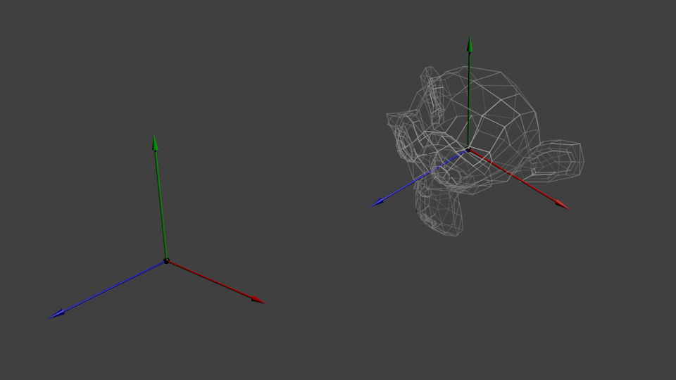

现在，物体所有顶点都位于世界坐标系。下图中黑色箭头的意思是：*从模型坐标系（Model Space）（顶点都相对于模型的中心定义）变换到世界坐标系（顶点都相对于世界坐标系中心定义）。*

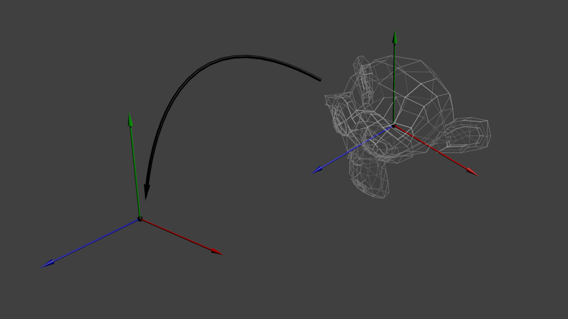

下图概括了这一过程：

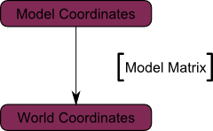

####视图矩阵

这里再引用一下《飞出个未来》：

引擎完全没有推动飞船。飞船静止在原处，而引擎推动了环绕着飞船的宇宙。

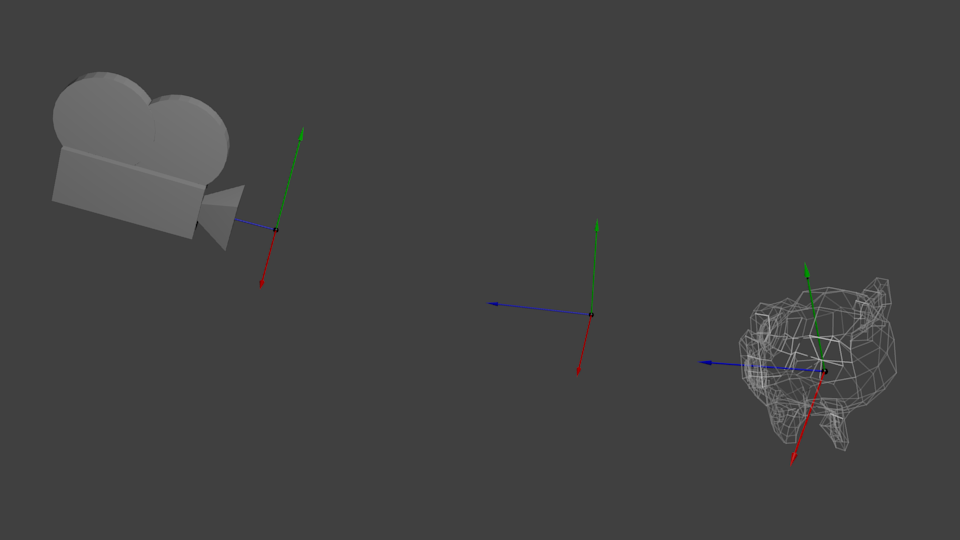

仔细想想，相机的原理也是相通的。如果想换个角度观察一座山，你可以移动相机也可以……移动山。后者在生活中不可行，在计算机图形学中却十分方便。

起初，相机位于世界坐标系的原点。移动世界只需乘上一个矩阵。假如你想把相机向右（X轴正方向）移动3个单位，这和把整个世界（包括网格）向左（X轴负方向）移3个单位是等效的！脑子有点乱？来写代码：

```cpp
// Use #include <glm/gtc/matrix_transform.hpp> and #include <glm/gtx/transform.hpp>
glm::mat4 ViewMatrix = glm::translate(-3,0,0);
```

下图展示了：从世界坐标系（顶点都相对于世界坐标系中心定义）到观察坐标系（Camera Space，顶点都相对于相机定义）的变换。

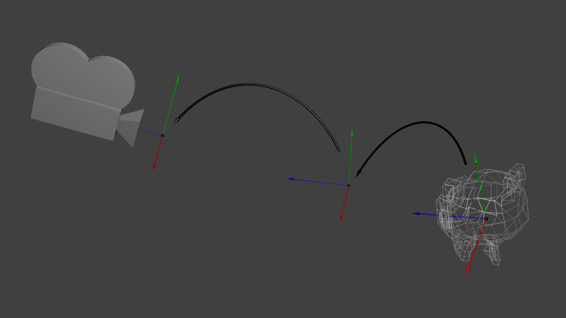

**在脑袋撑爆前，来欣赏一下GLM伟大的glm::LookAt函数吧：**

```cpp
glm::mat4 CameraMatrix = glm::LookAt(
    cameraPosition, // the position of your camera, in world space
    cameraTarget,   // where you want to look at, in world space
    upVector        // probably glm::vec3(0,1,0), but (0,-1,0) would make you looking upside-down, which can be great too
);
```

下图解释了上述变换过程：

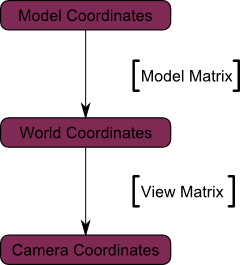

还没完呢。

####投影矩阵

现在，我们处于观察坐标系中。这意味着，经历了这么多变换后，现在一个坐标为(0,0)的顶点，应该被画在屏幕的中心。但仅有x、y坐标还不足以确定物体是否应该画在屏幕上：它到相机的距离（z）也很重要！两个x、y坐标相同的顶点，z值较大的一个将会最终显示在屏幕上。

这就是所谓的透视投影（perspective projection）：

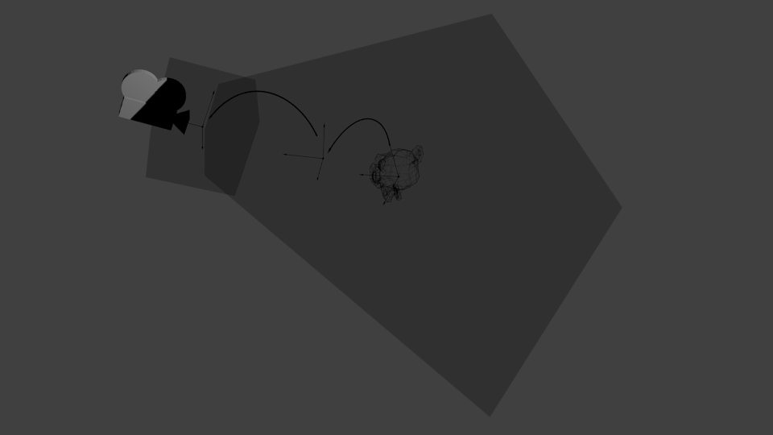

好在用一个4×4矩阵就能表示这个投影¹ :

```cpp
// Generates a really hard-to-read matrix, but a normal, standard 4x4 matrix nonetheless
glm::mat4 projectionMatrix = glm::perspective(
    FoV,         // The horizontal Field of View, in degrees : the amount of "zoom". Think "camera lens". Usually between 90° (extra wide) and 30° (quite zoomed in)
    4.0f / 3.0f, // Aspect Ratio. Depends on the size of your window. Notice that 4/3 == 800/600 == 1280/960, sounds familiar ?
    0.1f,        // Near clipping plane. Keep as big as possible, or you'll get precision issues.
    100.0f       // Far clipping plane. Keep as little as possible.
);
```

最后一个变换：

*从观察坐标系（顶点都相对于相机定义）到齐次坐标系（Homogeneous Space）（顶点都在一个小立方体中定义。立方体内的物体都会在屏幕上显示）的变换。*

最后一幅图示：

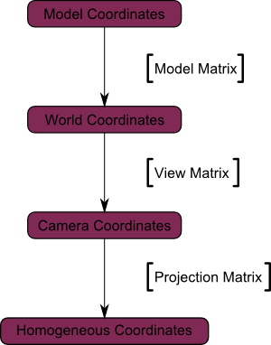

再添几张图，以便大家更好地理解投影变换。投影前，蓝色物体都位于观察坐标系中，红色的东西是相机的视域四棱锥（frustum）：这是相机实际能看见的区域。

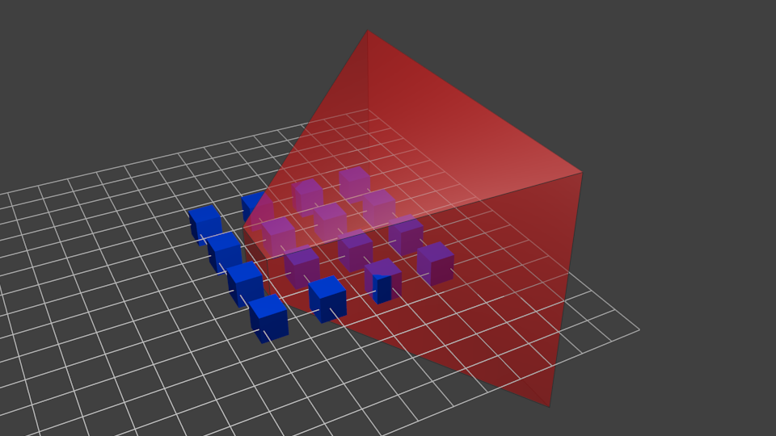

用投影矩阵去乘前面的结果，得到如下效果：

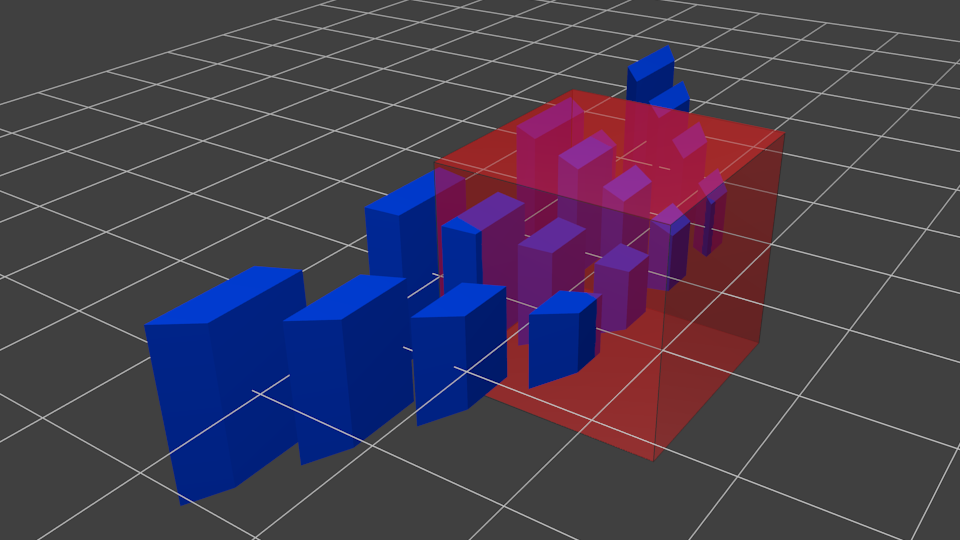

此图中，视域四棱锥变成了一个正方体（每条棱的范围都是-1到1，图上不太明显），所有的蓝色物体都经过了相同的形变。因此，离相机近的物体就显得大一些，远的显得小一些。和真实生活中一样！

让我们从视域四棱锥的“后面”看看它们的模样：

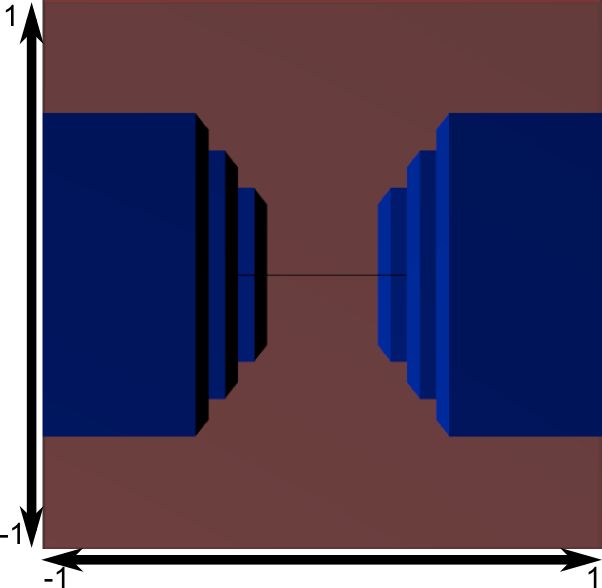

这就是你得出的图像了！看上去太方方正正了，因此，还需要做一次数学变换使之适合实际的窗口大小：

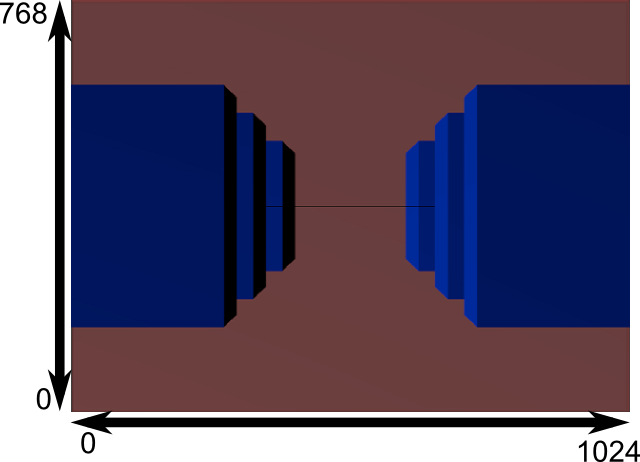

这就是实际渲染的图像啦！

####复合变换：模型视图投影矩阵（MVP）

… 再来一串亲爱的矩阵乘法：

```cpp
// C++ : compute the matrix
glm::mat3 MVPmatrix = projection * view * model; // Remember : inverted !
// GLSL : apply it
transformed_vertex = MVP * in_vertex;
```

###总结

**第一步：创建模型视图投影（MVP）矩阵。任何要渲染的模型都要做这一步。**

```cpp
// Projection matrix : 45° Field of View, 4:3 ratio, display range : 0.1 unit  100 units
glm::mat4 Projection = glm::perspective(45.0f, 4.0f / 3.0f, 0.1f, 100.0f);
// Camera matrix
glm::mat4 View       = glm::lookAt(
    glm::vec3(4,3,3), // Camera is at (4,3,3), in World Space
    glm::vec3(0,0,0), // and looks at the origin
    glm::vec3(0,1,0)  // Head is up (set to 0,-1,0 to look upside-down)
);
// Model matrix : an identity matrix (model will be at the origin)
glm::mat4 Model      = glm::mat4(1.0f);  // Changes for each model !
// Our ModelViewProjection : multiplication of our 3 matrices
glm::mat4 MVP        = Projection * View * Model; // Remember, matrix multiplication is the other way around
```

**第二步：把MVP传给GLSL**

```cpp
// Get a handle for our "MVP" uniform.
// Only at initialisation time.
GLuint MatrixID = glGetUniformLocation(programID, "MVP");

// Send our transformation to the currently bound shader,
// in the "MVP" uniform
// For each model you render, since the MVP will be different (at least the M part)
glUniformMatrix4fv(MatrixID, 1, GL_FALSE, &MVP[0][0]);
```
**第三步：在GLSL中用MVP变换顶点**

```cpp
in vec3 vertexPosition_modelspace;
uniform mat4 MVP;

void main(){

    // Output position of the vertex, in clip space : MVP * position
    vec4 v = vec4(vertexPosition_modelspace,1); // Transform an homogeneous 4D vector, remember ?
    gl_Position = MVP * v;
}
```

**完成！三角形和第二课的一样，仍然在原点(0, 0, 0)，然而是从点(4, 3, 3)透视观察的；相机的上方向为(0, 1, 0)，视场角（field of view）45°。**

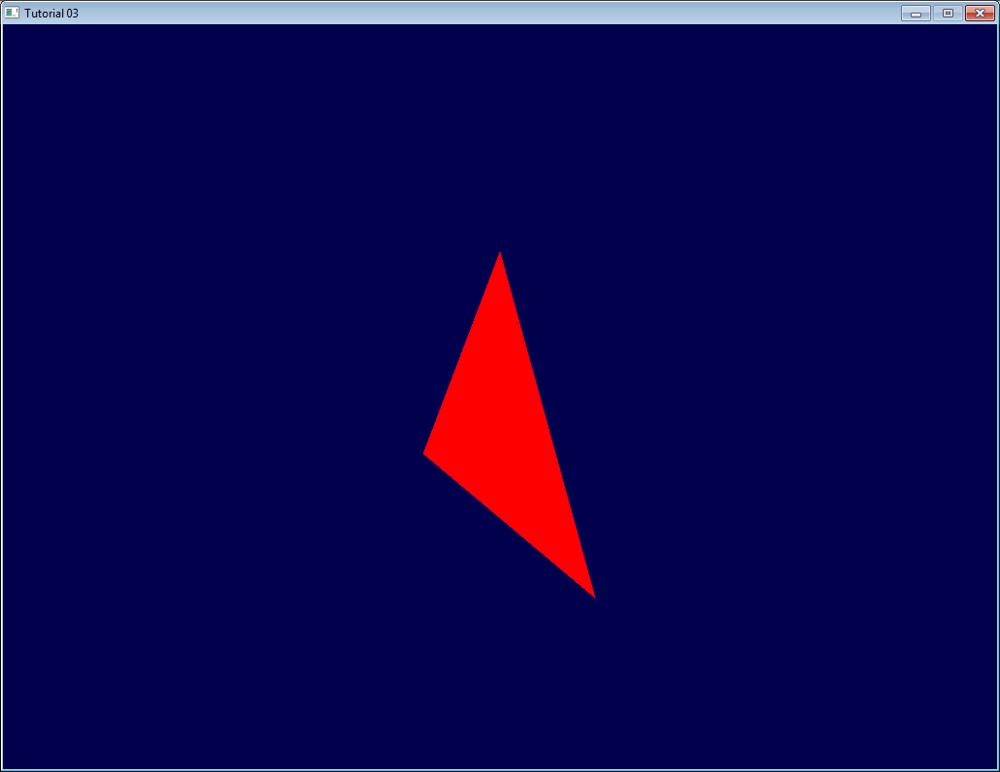

第6课中你会学到怎样用键鼠动态修改这些值，从而创建一个和游戏中类似的相机。但我们会先学给三维模型上色（第4课）、贴纹理（第5课）。

###练习

**试着替换glm::perspective**

**不用透视投影，试试正交投影（orthographic projection ）（glm::ortho）**

**把ModelMatrix改成先平移，再旋转，最后放缩三角形**

**其他不变，但把模型矩阵运算改成平移-旋转-放缩的顺序，会有什么变化？如果对一个人作变换，你觉得什么顺序最好呢？**

*附注*
 
 
*1 : [...]好在用一个4×4矩阵就能表示这个投影：实际上，这句话并不对。透视变换不是仿射（affine）的，因此，透视投影无法完全由一个矩阵表示。向量与投影矩阵相乘之后，它齐次坐标的每个分量都要除以自身的W（透视除法）。W分量恰好是-Z（投影矩阵会保证这一点）。这样，离原点更远的点，被除了较大的Z值；其X、Y坐标变小，点与点之间变紧，物体看起来就小了，这才产生了透视效果。*

`教程看不懂？教程不够详细？有错别字？` [请点击这里提交问题，我们一定会竭诚为您服务！](https://github.com/andyque/opengl-tutorials/issues/new)
