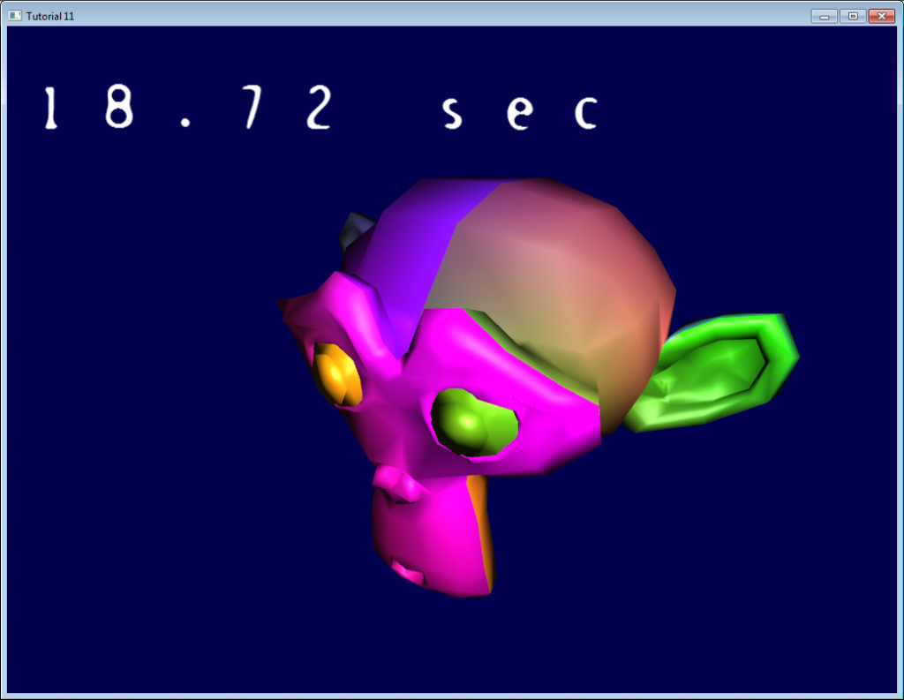
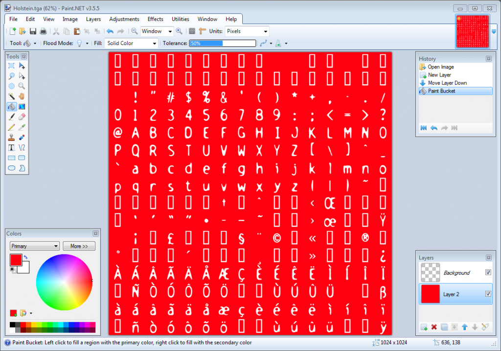

<style>
  h3 {
	margin: 20px 0px 10px 0px;
  }
</style>

免责申明（必读！）：本网站提供的所有教程的翻译原稿均来自于互联网，仅供学习交流之用，切勿进行商业传播。同时，转载时不要移除本申明。如产生任何纠纷，均与本博客所有人、发表该翻译稿之人无任何关系。谢谢合作！

原文链接：[http://www.opengl-tutorial.org/beginners-tutorials/tutorial-8-basic-shading/](http://www.opengl-tutorial.org/beginners-tutorials/tutorial-8-basic-shading/)

原译文链接: [https://github.com/cybercser/OpenGL_3_3_Tutorial_Translation/blob/master/Tutorial%209%20VBO%20Indexing%20opengl-tutorial.org.md](https://github.com/cybercser/OpenGL_3_3_Tutorial_Translation/blob/master/Tutorial%209%20VBO%20Indexing%20opengl-tutorial.org.md)

第十一课：2D文本

本课将学习如何在三维场景之上绘制二维文本。本例是一个简单的计时器：



API
---
我们将实现这些简单的接口（位于`common/text2D.h`）：
```cpp
    void initText2D(const char * texturePath);
    void printText2D(const char * text, int x, int y, int size);
    void cleanupText2D();
```
为了让代码在640\*480和1080p分辨率下都能正常工作，x和y的范围分别设为[0-800]和[0-600]。顶点着色器将根据实际屏幕大小做对它做调整。

完整的实现代码请参阅`common/text2D.cpp`。

纹理
---
`initText2D`简单地读取一个纹理和一些着色器，很好理解。来看看纹理：



该纹理由[CBFG](http://www.codehead.co.uk/cbfg/)生成。CBFG是诸多从字体生成纹理的工具之一。把纹理加载到Paint.NET，加上红色背景（仅为了观察方便；本教程中的红色背景，都代表透明）。

`printText2D()`在屏幕的适当位置，生成一个纹理坐标正确的四边形。

绘制
---
首先，填充这些缓冲区：
```cpp
    std::vector<glm::vec2> vertices;
    std::vector<glm::vec2> UVs;
```
文本中的每个字母，都要计算其四边形包围盒的顶点坐标，然后添加两个三角形（组成一个四边形）：
```cpp
    for ( unsigned int i=0 ; i<length ; i++ ){
    
        glm::vec2 vertex_up_left??? = glm::vec2( x+i*size???? , y+size );
        glm::vec2 vertex_up_right?? = glm::vec2( x+i*size+size, y+size );
        glm::vec2 vertex_down_right = glm::vec2( x+i*size+size, y????? );
        glm::vec2 vertex_down_left? = glm::vec2( x+i*size???? , y????? );
    
        vertices.push_back(vertex_up_left?? );
        vertices.push_back(vertex_down_left );
        vertices.push_back(vertex_up_right? );
    
        vertices.push_back(vertex_down_right);
        vertices.push_back(vertex_up_right);
        vertices.push_back(vertex_down_left);
```
轮到UV坐标了。计算左上角的坐标：
```cpp
        char character = text[i];
        float uv_x = (character%16)/16.0f;
        float uv_y = (character/16)/16.0f;
```
这样做是可行的（基本可行，详见下文），因为[A的ASCII值](http://www.asciitable.com/)为65。
65%16 = 1，因此A位于第1列（列号从0开始）。

65/16 = 4，因此A位于第4行（这是整数除法，所以结果不是想象中的4.0625）

两者都除以16.0以使之落于[0.0 - 1.0]区间内，这正是OpenGL纹理所需的。

现在只需对顶点重复相同的操作：
```cpp
        glm::vec2 uv_up_left    = glm::vec2( uv_x           , 1.0f - uv_y );
        glm::vec2 uv_up_right   = glm::vec2( uv_x+1.0f/16.0f, 1.0f - uv_y );
        glm::vec2 uv_down_right = glm::vec2( uv_x+1.0f/16.0f, 1.0f - (uv_y + 1.0f/16.0f) );
        glm::vec2 uv_down_left  = glm::vec2( uv_x           , 1.0f - (uv_y + 1.0f/16.0f) );
     
        UVs.push_back(uv_up_left   );
        UVs.push_back(uv_down_left );
        UVs.push_back(uv_up_right  );
     
        UVs.push_back(uv_down_right);
        UVs.push_back(uv_up_right);
        UVs.push_back(uv_down_left);
}
```
其余的操作和往常一样：绑定缓冲区，填充，选择着色器程序，绑定纹理，开启、绑定、配置顶点属性，开启混合，调用glDrawArrays。欧也，搞定了。

注意非常重要的一点：这些坐标位于[0,800][0,600]范围内。也就是说，这里**不需要**矩阵。vertex shader只需简单换算就可以把这些坐标转换到[-1,1][-1,1]范围内（也可以在C++代码中完成这一步）。
```glsl
    void main(){
     
        // Output position of the vertex, in clip space
        // map [0..800][0..600] to [-1..1][-1..1]
        vec2 vertexPosition_homoneneousspace = vertexPosition_screenspace - vec2(400,300); // [0..800][0..600] -> [-400..400][-300..300]
        vertexPosition_homoneneousspace /= vec2(400,300);
        gl_Position =  vec4(vertexPosition_homoneneousspace,0,1);
     
        // UV of the vertex. No special space for this one.
        UV = vertexUV;
    }
```
fragment shader的工作也很少：
```glsl
    void main(){
        color = texture( myTextureSampler, UV );
    }
```
顺便说一下，别在工程中使用这些代码，因为它只能处理拉丁字符。否则你的产品在印度、中国、日本（甚至德国，因为纹理上没有ß这个字母）就别想卖了。这幅纹理是我用法语字符集生成的，在法国用用还可以（注意 é, à, ç等字母）。修改其他教程的代码时注意库的使用。其他教程大多使用OpenGL 2，和本教程不兼容。很可惜，我还没找到一个足够好的、能处理UTF-8字符集的库。

顺带提一下，您最好看看Joel Spolsky写的[The Absolute Minimum Every Software Developer Absolutely, Positively Must Know About Unicode and Character Sets (No Excuses!)](http://www.joelonsoftware.com/articles/Unicode.html)。

如果您需要处理大量的文本，可以参考这篇[Valve的文章](http://www.valvesoftware.com/publications/2007/SIGGRAPH2007_AlphaTestedMagnification.pdf)。

