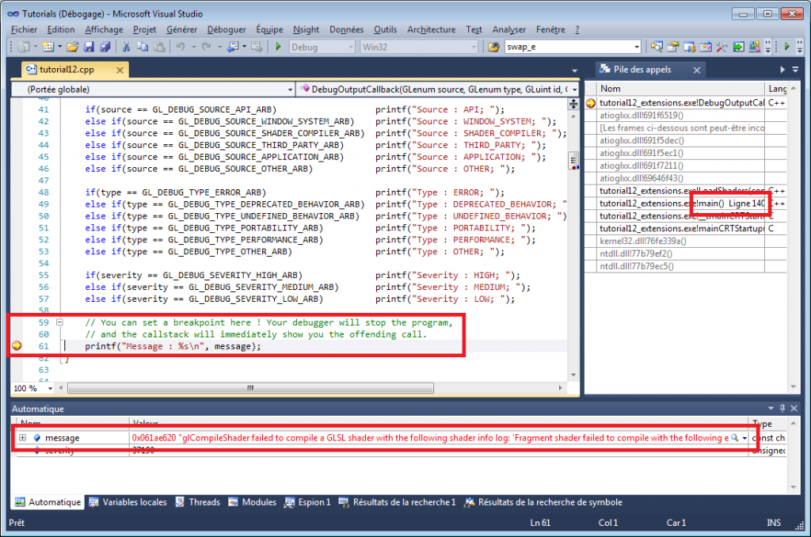

<style>
  h3 {
	margin: 20px 0px 10px 0px;
  }
</style>

免责申明（必读！）：本网站提供的所有教程的翻译原稿均来自于互联网，仅供学习交流之用，切勿进行商业传播。同时，转载时不要移除本申明。如产生任何纠纷，均与本博客所有人、发表该翻译稿之人无任何关系。谢谢合作！

原文链接：[http://www.opengl-tutorial.org/intermediate-tutorials/tutorial-12-opengl-extensions/](http://www.opengl-tutorial.org/intermediate-tutorials/tutorial-12-opengl-extensions/)

## 第十二课：OpenGL扩展

### 扩展

GPU的性能随着更新换代一直在提高，支持渲染更多的三角形和像素点。然而，原始性能不是我们唯一关心的。NVIDIA, AMD和Intel也通过增加功能来改善他们的显卡。来看一些例子。

#### ARB_fragment_program

回溯到2002年，GPU都没有顶点着色器或片断着色器：所有的一切都硬编码在芯片中。这被称为固定功能流水线（Fixed-Function Pipeline (FFP)）。同样地，当时最新的OpenGL 1.3中也没有接口可以创建、操作和使用所谓的“着色器”，因为它根本不存在。接着NVIDIA决定用实际代码描述渲染过程，来取代数以百计的标记和状态量。这就是ARB_fragment_program的由来。当时还没有GLSL，但你可以写这样的程序：

```
!!ARBfp1.0 MOV result.color, fragment.color; END
```

但若要显式地令OpenGL使用这些代码，你需要一些还不在OpenGL里的特殊函数。在进行解释前，再举个例子。

#### ARB_debug_output

好，你说『ARB_fragment_program太老了，所以我不需要扩展这东西』？其实有不少新的扩展非常方便。其中一个便是ARB_debug_output，它提供了一个不存在于OpenGL 3.3中的，但你可以/应该用到的功能。它定义了像GL_DEBUG_OUTPUT_SYNCHRONOUS_ARB或GL_DEBUG_SEVERITY_MEDIUM_ARB之类的字符串，和DebugMessageCallbackARB这样的函数。这个扩展的伟大之处在于，当你写了一些不正确的代码，例如：

```
glEnable(GL_TEXTURE); // Incorrect ! You probably meant GL_TEXTURE_2D !
```

你能得到错误消息和错误的精确位置。总结：

- 即便在现在的OpenGL 3.3中，扩展仍旧十分有用。
- 请使用ARB_debug_output ！下文有链接。



#### 获取扩展 – 复杂的方式

『手动』查找一个扩展的方法是使用以下代码片断 (转自OpenGL.org wiki)：

```
int NumberOfExtensions;
glGetIntegerv(GL_NUM_EXTENSIONS, &NumberOfExtensions);
for(i=0; i<NumberOfExtensions; i++) {
  const GLubyte *ccc=glGetStringi(GL_EXTENSIONS, i);
  if ( strcmp(ccc, (const GLubyte *)"GL_ARB_debug_output") == 0 ){
    // The extension is supported by our hardware and driver
    // Try to get the "glDebugMessageCallbackARB" function :
    glDebugMessageCallbackARB  = (PFNGLDEBUGMESSAGECALLBACKARBPROC) wglGetProcAddress("glDebugMessageCallbackARB");
  }
}
```

#### 获得所有的扩展 – 简单的方式

上面的方式太复杂。若用GLEW, GLee, gl3w这些库，就简单多了。例如，有了GLEW，你只需要在创建窗口后调用glewInit()，不少方便的变量就创建好了：

```
if (GLEW_ARB_debug_output){ // Ta-Dah ! }
```

(小心：debug_output是特殊的，因为你需要在上下文创建的时候启用它。在GLFW中，这通过glfwOpenWindowHint(GLFW_OPENGL_DEBUG_CONTEXT, 1)完成。)

#### ARB vs EXT vs …

扩展的名字暗示了它的适用范围：

GL_:所有平台；
GLX_:只有Linux和Mac下可使用（X11）；
WGL_:只有Windows下可使用。

EXT:通用的扩展。
ARB:已经被OpenGL架构评审委员会的所有成员接受（EXT扩展没多久后就经常被提升为ARB）的扩展。
NV/AMD/INTEL:顾名思义 =)

### 设计与扩展
#### 问题

比方说，你的OpenGL 3.3应用程序需要渲染一些大型线条。你能够写一个复杂的顶点着色器来完成，或者简单地用[GL_NV_path_rendering](http://www.opengl.org/registry/specs/NV/path_rendering.txt)，它能帮你处理所有复杂的事。

因此你可以这样写代码：

```
if ( GLEW_NV_path_rendering ){
    glPathStringNV( ... ); // Draw the shape. Easy !
}else{
    // Else what ? You still have to draw the lines
    // on older NVIDIA hardware, on AMD and on INTEL !
    // So you have to implement it yourself anyway !
}
```

#### 均衡考量

当使用扩展的益处（如渲染质量、性能），超过维护两种不同方法（如上面的代码，一种靠你自己实现，一种使用扩展）的代价时，通常就选择用扩展。

例如，在时空幻境（Braid, 一个时空穿越的二维游戏）中，当你干扰时间时，就会有各种各样的图像变形效果，而这种效果在旧硬件上没法渲染。

而在OpenGL 3.3及更高版本中，包含了99%的你可能会用到的工具。一些扩展很有用，比如GL_AMD_pinned_memory,虽然它通常没法像几年前使用GL_ARB_framebuffer_object(用于纹理渲染)那样让你的游戏看起来变好10倍。

如果你不得不兼容老硬件，那么就不能用OpenGL 3+，你需要用OpenGL 2+来代替。你将不再能使用各种神奇的扩展了，你需自行处理那些问题。

更多的细节可以参考例子[OpenGL 2.1版本的第14课 – 纹理渲染](http://code.google.com/p/opengl-tutorial-org/source/browse/tutorial14_render_to_texture/tutorial14.cpp?name=2.1%20branch#152)，第152行，需手动检查GL_ARB_framebuffer_object是否存在。常见问题可见FAQ。

### 结论Conclusion

OpenGL扩展提供了一个很好的方式来增强OpenGL的功能，它依赖于你用户的GPU。

虽然现在扩展属于高级用法（因为大部分功能在核心中已经有了），了解扩展如何运作和怎么用它提高软件性能（付出更高的维护代价）还是很重要的。

### 深度阅读

- debug_output tutorial by Aks 因为有GLEW，你可以跳过第一步。
- [The OpenGL extension registry](http://www.opengl.org/registry/) 所有扩展的规格说明。圣经。
- [GLEW](http://glew.sourceforge.net/) OpenGL标准扩展库
- [gl3w](https://github.com/skaslev/gl3w) 简单的OpenGL 3/4核心配置加载


`教程看不懂？教程不够详细？有错别字？` [请点击这里提交问题，我们一定会竭诚为您服务！](https://github.com/andyque/opengl-tutorials/issues/new)
