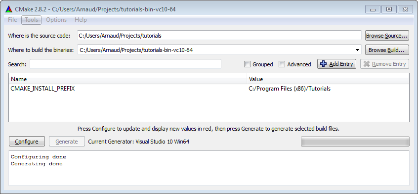
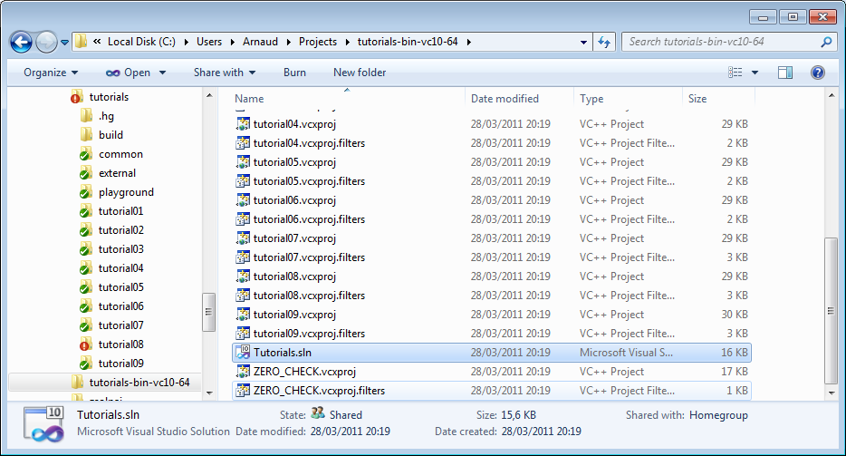
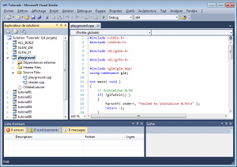
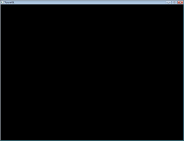
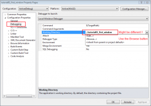

免责申明（必读！）：本网站提供的所有教程的翻译原稿均来自于互联网，仅供学习交流之用，切勿进行商业传播。同时，转载时不要移除本申明。如产生任何纠纷，均与本博客所有人、发表该翻译稿之人无任何关系。谢谢合作！

原文链接：[http://www.opengl-tutorial.org/beginners-tutorials/tutorial-1-opening-a-window/](http://www.opengl-tutorial.org/beginners-tutorials/tutorial-1-opening-a-window/)

原译文链接: [http://www.opengl-tutorial.org/zh-hans/beginners-tutorials-zh/tutorial-1-opening-a-window-zh/](http://www.opengl-tutorial.org/zh-hans/beginners-tutorials-zh/tutorial-1-opening-a-window-zh/)

##第一课： 新建一个窗口

###简介

欢迎来到第一课！

在学习OpenGL之前，我们将先学习如何生成，运行，和玩转（最重要的一点）课程中的代码。

###预备知识

不需要特别的预备知识。如果你有C、Java、Lisp、Javascript等编程语言的经验，那么理解课程代码会更快；但这不是必需的；如果没有，那么也仅仅是同时学两样东西（编程语言+OpenGL）会稍微复杂点而已。

课程全部用“傻瓜式C++”编写：我费了很大劲尽量让代码简单些。代码里没有模板（template）、类或指针。就是说，即使只懂Java，也能理解所有内容。

###忘记一切
如前面所说，我们不需要预备知识；但请暂时把『老式OpenGL』先忘了吧（例如glBegin()这类东西）。
在这里，你将学习新式OpenGL（OpenGL 3和4），而多数网上教程还在讲『老式OpenGL』（OpenGL 1和2）。所以，在你的脑袋乱成一锅粥之前，把它们都搁在一边吧。


###生成课程中的代码

所有课程代码都能在Windows、Linux、和Mac上生成，而且过程大体相同：

- 更新驱动 ！！赶快更新吧。我可是提醒过你哟。
- 下载C++编译器。
- 安装CMake
- 下载全部课程代码
- 用CMake创建工程
- 编译工程
- 试试这些例子！

各平台的详细代码生成过程将会在后面一一给出，不过具体每个平台可能会有差异。如果你不确定，可以去看看Windows平台的生成说明，然后按照需改动一下来适应你自己的平台。

####在Windows平台上生成课程代码

1. 更新驱动应该很轻松。直接去NVIDIA或者AMD的官网下载。若不清楚GPU的型号:控制面板->系统和安全->系统->设备管理器->显示适配器。如果是Intel集成显卡，一般由电脑厂商（Dell、HP等）提供驱动。

2. 建议用Visual Studio 2010 Express来编译。 这里可以免费下载。 若喜欢用MinGW，推荐[Qt Creator](http://qt-project.org/)。安装哪个都行。下列步骤是用Visual Studio讲解的，其他IDE也差不多。

3. 从这里下载安装 [CMake](http://www.cmake.org/cmake/resources/software.html) 。

4. [下载课程源码](http://www.opengl-tutorial.org/?page_id=200) ，解压到例如C:/Users/XYZ/Projects/OpenGLTutorials .

5. 启动CMake。让第一栏路径指向刚才解压缩的文件夹；若不确定，就选包含CMakeLists.txt的文件夹。第二栏，填CMake输出路径 （译者注：这里CMake输出一个可以在Visual Studio中打开和编译的工程）。例如C:/Users/XYZ/Projects/OpenGLTutorials-build-Visual2010-32bits，或者C:/Users/XYZ/Projects/OpenGLTutorials/build/Visual2010-32bits。注意，此处可随便填，不一定要和源码在同一文件夹。



6. 点击Configure。由于是首次configure工程，CMake会让你选择编译器。根据步骤1选择。如果你的Windows是64位的，选64位。不清楚就选32位。\

7. 再点Configure直至红色行全部消失。点Generate。Visual Studio工程创建完毕。Visual Studio工程创建完毕。不再需要CMake了，可以卸载掉。

8. 打开 C:/Users/XYZ/Projects/OpenGL/Tutorials-build-Visual2010-32bits会看到Tutorials.sln文件（译者注：这就是CMake生成的VS项目文件），用Visual Studio打开它。



在 Build 菜单中，点Build All。每个课程代码和依赖项都会被编译。生成的可执行文件会出现在 C:/Users/XYZ/Projects/OpenGLTutorials。但愿不会报错。



9. 打开C:/Users/XYZ/Projects/OpenGLTutorials/playground，运行playground.exe，会弹出一个黑色窗口。



也可以在Visual Studio中运行任意一课的代码，但得先设置工作目录：右键点击Playground，选择Debugging、Working Directory、Browse，设置路径为C:/Users/XYZ/Projects/OpenGLTutorials/playground。验证一下。再次右键点击Playground，“Choose as startup project”。按F5就可以调试了。




###在Linux上生成
Linux版本众多，这里不可能列出所有的平台。按需变通一下吧，也不妨看一下发行版文档。

1. 安装最新驱动。强烈推荐闭源的二进制驱动；它们不开源，但好用。如果发行版不提供自动安装，试试[Ubuntu指南](http://help.ubuntu.com/community/BinaryDriverHowto).

2. 安装全部需要的编译器、工具和库。完整清单如下：cmake make g++ libx11-dev libgl1-mesa-dev libglu1-mesa-dev libxrandr-dev libxext-dev 。 用 sudo apt-get install ***** 或者 su && yum install ******。

3. [下载课程源码](http://www.opengl-tutorial.org/?page_id=200) 并解压到如 ~/Projects/OpenGLTutorials/

4. 接着输入如下命令 :

```
cd ~/Projects/OpenGLTutorials/
mkdir build
cd build
cmake ..
```

5. build/目录会创建一个makefile文件。

6. 键入“make all”。每个课程代码和依赖项都会被编译。生成的可执行文件在~/Projects/OpenGLTutorials/。但愿不会报错。

7. 打开~/Projects/OpenGLTutorials/playground，运行./playground会弹出一个黑色窗口。

提示：推荐使用[Qt Creator](http://qt-project.org/)作为IDE。值得一提的是，Qt Creator内置支持CMake，调试起来也顺手。如下是QtCreator使用说明：

1.在QtCreator中打开Tools->Options->Compile-&Execute->CMake

2.设置CMake路径。很可能像这样/usr/bin/cmake

3.File->Open Project；选择 tutorials/CMakeLists.txt

4.选择生成目录，最好选择tutorials文件夹外面

5.还可以在参数栏中设置-DCMAKE_BUILD_TYPE=Debug。验证一下。

6.点击下面的锤子图标。现在教程可以从tutorials/文件夹启动了。

7.要想在QtCreator中运行教程源码，点击Projects->Execution parameters->Working Directory，选择着色器、纹理和模型所在目录。以第二课为例：~/opengl-tutorial/tutorial02_red_triangle/


###在Mac上生成

Mac OS不支持OpenGL 3.3。最近，搭载MacOS 10.7 Lion和兼容型GPU的Mac电脑可以跑OpenGL 3.2了，但3.3还不行；所以我们用2.1移植版的课程代码。除此外，其他步骤和Windows类似（也支持Makefiles，此处不赘述）：

1.从Mac App Store安装XCode

2.下载[CMake](http://www.cmake.org/cmake/resources/software.html)，安装.dmg。无需安装命令行工具。

3.下载[课程源码](http://www.opengl-tutorial.org/?page_id=200) （2.1版！！）解压到如~/Projects/OpenGLTutorials/ .

4.启动CMake （Applications->CMake）。让第一栏路径指向刚才解压缩的文件夹，不确定就选包含CMakeLists.txt的文件夹。第二栏，填CMake输出路径。例如~/Projects/OpenGLTutorials_bin_XCode/。注意，这里可以随便填，不一定要和源码在同一文件夹。

5.点击Configure。由于是首次configure工程，CMake会让你选择编译器。选择Xcode。

6.再点Configure直至红色行全部消失。点Generate。Xcode项目创建完毕。不再需要CMake了，可以卸载掉。

7.打开~/Projects/OpenGLTutorials_bin_XCode/会看到Tutorials.xcodeproj文件：打开它。

8.选择一个教程，在Xcode的Scheme面板上运行，点击Run按钮编译和运行：


**在第二课及后续课程中，Run按钮就失效了。下一版本会解决这个bug。目前，请用Cmd-B键运行（双击源码文件夹/tutorialX/tutorialX，或者通过终端）。**

##关于Code::Blocks的说明
由于C::B和CMake中各有一个bug，你得在Project->Build->Options->Make commands中手动设置编译命令，如下图所示：


同时你还得手动设置工作目录：Project->Properties->Build targets->tutorial N->execution working dir（即src_dir/tutorial_N/）。

##运行课程例子
一定要在正确的目录下运行课程例子：你可以双击可执行文件；如果爱用命令行，请用cd命令切换到正确的目录。

若想从IDE中运行程序，别忘了看看上面的说明——先正确设置工作目录。

##如何学习本课程
每课都附有源码和数据，可在tutorialXX/找到。不过，建议您不改动这些工程，将它们作为参考；推荐在playground/playground.cpp中做试验，怎么折腾都行。要是弄乱了，就去粘一段课程代码，一切就会恢复正常。

我们会在整个教程中提供代码片段。不妨在看教程时，直接把它们复制到playground里跑跑看。动手实验才是王道。单纯看别人写好的代码学不了多少。即使仅仅粘贴一下代码，也会碰到不少问题。

##新建一个窗口
终于！写OpenGL代码的时刻来了！

呃，其实还早着呢。有的教程都会教你以“底层”的方式做事，好让你清楚每一步的原理。但这往往很无聊也无用。所以，我们用一个外部的库——GLFW来帮我们处理窗口、键盘消息等细节。你也可以使用Windows的Win32 API、Linux的X11 API，或Mac的Cocoa API；或者用别的库，比如SFML、FreeGLUT、SDL等，请参见链接页。

我们开始吧。从处理依赖库开始：我们要用一些基本库，在控制台显示消息：

```
// Include standard headers
#include <stdio.h>
#include <stdlib.h>
```

然后是GLEW库。这东西的原理，我们以后再说。

```
// Include GLEW. Always include it before gl.h and glfw.h, since it's a bit magic.
#include <GL/glew.h>
```

我们使用GLFW库处理窗口和键盘消息，把它也包含进来：

```
// Include GLFW
#include <GL/glfw.h>
```

下面的GLM是个很有用的三维数学库，我们暂时没用到，但很快就会用上。GLM库很好用，但没有什么神奇的，你自己也可以写一个。添加“using namespace”是为了不用写“glm::vec3”，直接写“vec3”。

```
// Include GLM
#include <glm/glm.hpp>
using namespace glm;
```

如果把这些#include都粘贴到playground.cpp，编译器会报错，说缺少main函数。所以我们创建一个 ：

```
int main(){
```

首先初始化GLFW ：

```
// Initialise GLFW
if( !glfwInit() )
{
    fprintf( stderr, "Failed to initialize GLFW\n" );
    return -1;
}
```

可以创建我们的第一个OpenGL窗口啦！

```
glfwOpenWindowHint(GLFW_FSAA_SAMPLES, 4); // 4x antialiasing
glfwOpenWindowHint(GLFW_OPENGL_VERSION_MAJOR, 3); // We want OpenGL 3.3
glfwOpenWindowHint(GLFW_OPENGL_VERSION_MINOR, 3);
glfwOpenWindowHint(GLFW_OPENGL_PROFILE, GLFW_OPENGL_CORE_PROFILE); //We don't want the old OpenGL
 
// Open a window and create its OpenGL context
if( !glfwOpenWindow( 1024, 768, 0,0,0,0, 32,0, GLFW_WINDOW ) )
{
    fprintf( stderr, "Failed to open GLFW window\n" );
    glfwTerminate();
    return -1;
}
 
// Initialize GLEW
glewExperimental=true; // Needed in core profile
if (glewInit() != GLEW_OK) {
    fprintf(stderr, "Failed to initialize GLEW\n");
    return -1;
}
 
glfwSetWindowTitle( "Tutorial 01" );
```

编译并运行。一个窗口弹出后立即关闭了。可不是嘛！还没设置等待用户Esc按键再关闭呢：

```
// Ensure we can capture the escape key being pressed below
glfwEnable( GLFW_STICKY_KEYS );
 
do{
    // Draw nothing, see you in tutorial 2 !
 
    // Swap buffers
    glfwSwapBuffers();
 
} // Check if the ESC key was pressed or the window was closed
while( glfwGetKey( GLFW_KEY_ESC ) != GLFW_PRESS &&
glfwGetWindowParam( GLFW_OPENED ) );
```

第一课就到这啦！第二课会教大家画三角形。
