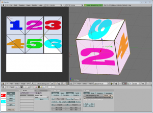
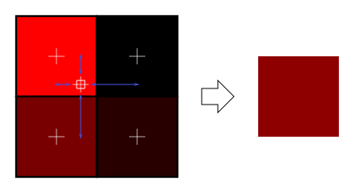
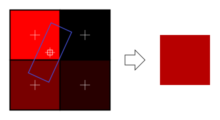
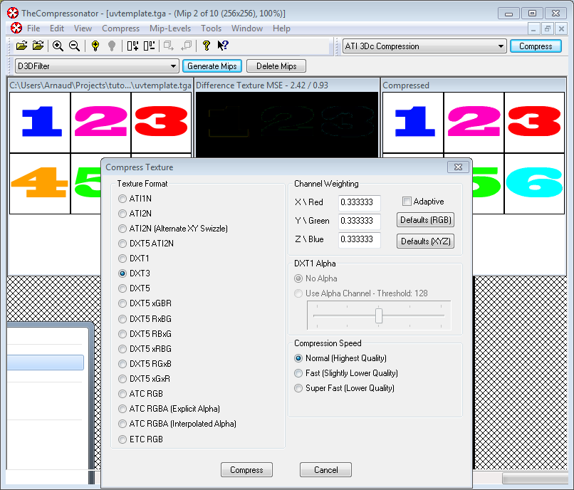

## 第五课：纹理立方体

本课学习如下几点：

- 什么是UV坐标
- 怎样自行加载纹理
- 怎样在OpenGL中使用纹理
- 什么是滤波？什么是mipmap？怎样使用？
- 怎样利用GLFW更加有效地加载纹理？
- 什么是alpha通道？

### 关于UV坐标

给一个模型贴纹理时，需要通过某种方式告诉OpenGL用哪一块图像来填充三角形。这是借助UV坐标来实现的。

每个顶点除了位置坐标外还有两个浮点数坐标：U和V。这两个坐标用于获取纹理，如下图所示：


注意纹理是怎样在三角形上扭曲的。

 
### 自行加载.BMP图片

了解BMP文件格式并不重要：很多库可以帮你做这个。但BMP格式极为简单，可以帮助你理解那些库的工作原理。所以，我们从头开始写一个BMP文件加载器，以便你理解其工作原理，不过（在实际工程中）**千万别再用这个实验品**。

如下是加载函数的声明：

```
GLuint loadBMP_custom(const char * imagepath);
```

使用方式如下：

```
GLuint image = loadBMP_custom("./my_texture.bmp");
```

接下来看看如何读取BMP文件。

首先需要一些数据。读取文件时将设置这些变量。

```
// Data read from the header of the BMP file
unsigned char header[54]; // Each BMP file begins by a 54-bytes header
unsigned int dataPos;     // Position in the file where the actual data begins
unsigned int width, height;
unsigned int imageSize;   // = width*height*3
// Actual RGB data
unsigned char * data;
```

现在正式开始打开文件。

```
// Open the file
FILE * file = fopen(imagepath,"rb");
if (!file)							    {printf("Image could not be openedn"); return 0;}
```

文件一开始是54字节长的文件头，用于标识“这是不是一个BMP文件”、图像大小、像素位等等。来读取文件头吧：

```
if ( fread(header, 1, 54, file)!=54 ){ // If not 54 bytes read : problem
    printf("Not a correct BMP filen");
    return false;
}
```

文件头总是以“BM”开头。实际上，如果用十六进制编辑器打开BMP文件，你会看到如下情形：


因此，得检查一下头两个字节是否确为‘B’和‘M’：

```
if ( header[0]!='B' || header[1]!='M' ){
    printf("Not a correct BMP filen");
    return 0;
}
```

现在可以读取文件中图像大小、数据位置等信息了：

```
// Read ints from the byte array
dataPos    = *(int*)&(header[0x0A]);
imageSize  = *(int*)&(header[0x22]);
width      = *(int*)&(header[0x12]);
height     = *(int*)&(header[0x16]);
```

如果这些信息缺失得手动补齐：

```
// Some BMP files are misformatted, guess missing information
if (imageSize==0)    imageSize=width*height*3; // 3 : one byte for each Red, Green and Blue component
if (dataPos==0)      dataPos=54; // The BMP header is done that way
```

现在我们知道了图像的大小，可以为之分配一些内存，把图像读进去：

```
// Create a buffer
data = new unsigned char [imageSize];

// Read the actual data from the file into the buffer
fread(data,1,imageSize,file);

//Everything is in memory now, the file can be closed
fclose(file);    
```

到了真正的OpenGL部分了。创建纹理和创建顶点缓冲器差不多：创建一个纹理、绑定、填充、配置。

在glTexImage2D函数中，GL_RGB表示颜色由三个分量构成，GL_BGR则说明在内存中颜色值是如何存储的。实际上，BMP存储的并不是RGB，而是BGR，因此得把这个告诉OpenGL。

```
// Create one OpenGL texture
GLuint textureID;
glGenTextures(1, &textureID);

// "Bind" the newly created texture : all future texture functions will modify this texture
glBindTexture(GL_TEXTURE_2D, textureID);

// Give the image to OpenGL
glTexImage2D(GL_TEXTURE_2D, 0,GL_RGB, width, height, 0, GL_BGR, GL_UNSIGNED_BYTE, data);

glTexParameteri(GL_TEXTURE_2D, GL_TEXTURE_MAG_FILTER, GL_NEAREST);
glTexParameteri(GL_TEXTURE_2D, GL_TEXTURE_MIN_FILTER, GL_NEAREST);
```

稍后再解释最后两行代码。同时，得在C++代码中使用刚写好的函数加载一个纹理：

```
GLuint Texture = loadBMP_custom("uvtemplate.bmp");
```

另外十分重要的一点： 使用2次幂（power-of-two）的纹理！

- 优质纹理： 128*128*, 256*256, 1024*1024, 2*2…
- 劣质纹理： 127*128, 3*5, …
- 勉强可以但很怪异的纹理： 128*256

### 在OpenGL中使用纹理

先来看看片断着色器。大部分代码一目了然：


```
#version 330 core	
// Interpolated values from the vertex shaders
in vec2 UV;

// Ouput data
out vec3 color;

// Values that stay constant for the whole mesh.
uniform sampler2D myTextureSampler;

void main(){

    // Output color = color of the texture at the specified UV
    color = texture( myTextureSampler, UV ).rgb;
}
```

注意三个点：

- 片断着色器需要UV坐标。看似合情合理。
- 同时也需要一个“Sampler2D”来获知要加载哪一个纹理（同一个着色器中可以访问多个纹理）
- 最后一点，用texture()访问纹理，该方法返回一个(R,G,B,A)的vec4变量。马上就会了解到分量A。

顶点着色器也很简单，只需把UV坐标传给片断着色器：

```
#version 330 core
// Input vertex data, different for all executions of this shader.
layout(location = 0) in vec3 vertexPosition_modelspace;
layout(location = 1) in vec2 vertexUV;

// Output data ; will be interpolated for each fragment.
out vec2 UV;

// Values that stay constant for the whole mesh.
uniform mat4 MVP;

void main(){

    // Output position of the vertex, in clip space : MVP * position
    gl_Position =  MVP * vec4(vertexPosition_modelspace,1);

    // UV of the vertex. No special space for this one.
    UV = vertexUV;
}
```

还记得第四课中的“layout(location = 1) in vec2 vertexUV” 吗？我们得在这儿把相同的事情再做一遍，但这次的缓冲器中放的不是(R,G,B)三元组，而是(U,V)数对。

```
// Two UV coordinatesfor each vertex. They were created with Blender. You'll learn shortly how to do this yourself.
static const GLfloat g_uv_buffer_data[] = {
    0.000059f, 1.0f-0.000004f,
    0.000103f, 1.0f-0.336048f,
    0.335973f, 1.0f-0.335903f,
    1.000023f, 1.0f-0.000013f,
    0.667979f, 1.0f-0.335851f,
    0.999958f, 1.0f-0.336064f,
    0.667979f, 1.0f-0.335851f,
    0.336024f, 1.0f-0.671877f,
    0.667969f, 1.0f-0.671889f,
    1.000023f, 1.0f-0.000013f,
    0.668104f, 1.0f-0.000013f,
    0.667979f, 1.0f-0.335851f,
    0.000059f, 1.0f-0.000004f,
    0.335973f, 1.0f-0.335903f,
    0.336098f, 1.0f-0.000071f,
    0.667979f, 1.0f-0.335851f,
    0.335973f, 1.0f-0.335903f,
    0.336024f, 1.0f-0.671877f,
    1.000004f, 1.0f-0.671847f,
    0.999958f, 1.0f-0.336064f,
    0.667979f, 1.0f-0.335851f,
    0.668104f, 1.0f-0.000013f,
    0.335973f, 1.0f-0.335903f,
    0.667979f, 1.0f-0.335851f,
    0.335973f, 1.0f-0.335903f,
    0.668104f, 1.0f-0.000013f,
    0.336098f, 1.0f-0.000071f,
    0.000103f, 1.0f-0.336048f,
    0.000004f, 1.0f-0.671870f,
    0.336024f, 1.0f-0.671877f,
    0.000103f, 1.0f-0.336048f,
    0.336024f, 1.0f-0.671877f,
    0.335973f, 1.0f-0.335903f,
    0.667969f, 1.0f-0.671889f,
    1.000004f, 1.0f-0.671847f,
    0.667979f, 1.0f-0.335851f
};
```

上述UV坐标对应于下面的模型：



其余的就很清楚了。创建一个缓冲器、绑定、填充、配置，与往常一样绘制顶点缓冲器对象。要注意把glVertexAttribPointer的第二个参数（大小）3改成2。

结果如下：   


放大后：


### 什么是滤波和mipmap？怎样使用？

正如在上面截图中看到的，纹理质量不是很好。这是因为在loadBMP_custom函数中，有两行这样写道：

```
glTexParameteri(GL_TEXTURE_2D, GL_TEXTURE_MAG_FILTER, GL_NEAREST);
glTexParameteri(GL_TEXTURE_2D, GL_TEXTURE_MIN_FILTER, GL_NEAREST);
```

这意味着在片断着色器中，texture()将直接提取位于(U,V)坐标的纹素（texel）。


有几种方法可以改善这一状况。

#### 线性滤波（Linear filtering）

若采用线性滤波。texture()会查看周围的纹素，然后根据UV坐标距离各纹素中心的距离来混合颜色。这就避免了前面看到的锯齿状边缘。



线性滤波可以显著改善纹理质量，应用的也很多。但若想获得更高质量的纹理，可以采用各向异性滤波，不过速度上有些慢。

#### 各向异性滤波（Anisotropic filtering）

这种方法逼近了真正片断中的纹素区块。例如下图中稍稍旋转了的纹理，各向异性滤波将沿蓝色矩形框的主方向，作一定数量的采样（即所谓的“各向异性层级”），计算出其内的颜色。



#### Mipmaps

线性滤波和各向异性滤波都存在一个共同的问题。那就是如果从远处观察纹理，只对4个纹素作混合显得不够。实际上，如果3D模型位于很远的地方，屏幕上只看得见一个片断（像素），那计算平均值得出最终颜色值时，图像所有的纹素都应该考虑在内。很显然，这样做没有考虑性能问题。相反，人们引入了mipmap这一概念：


- 一开始，把图像缩小到原来的1/2，接着一次做下去，直到图像只有1×1大小（应该是图像所有纹素的平均值）
- 绘制模型时，根据纹素大小选择合适的mipmap。
- 可以选用nearest、linear、anisotropic等任意一种滤波方式来对mipmap采样。
- 要想效果更好，可以对两个mipmap采样然后混合，得出结果。

好在这个比较简单，OpenGL都帮我们做好了，只需一个简单的调用：

```
// When MAGnifying the image (no bigger mipmap available), use LINEAR filtering
glTexParameteri(GL_TEXTURE_2D, GL_TEXTURE_MAG_FILTER, GL_LINEAR);
// When MINifying the image, use a LINEAR blend of two mipmaps, each filtered LINEARLY too
glTexParameteri(GL_TEXTURE_2D, GL_TEXTURE_MIN_FILTER, GL_LINEAR_MIPMAP_LINEAR);
// Generate mipmaps, by the way.
glGenerateMipmap(GL_TEXTURE_2D);
```

### 怎样利用GLFW加载纹理？

我们的loadBMP_custom函数很棒，因为这是我们自己写的！不过用专门的库更好。GLFW就可以加载纹理（仅限TGA文件）：

```
GLuint loadTGA_glfw(const char * imagepath){

    // Create one OpenGL texture
    GLuint textureID;
    glGenTextures(1, &textureID);

    // "Bind" the newly created texture : all future texture functions will modify this texture
    glBindTexture(GL_TEXTURE_2D, textureID);

    // Read the file, call glTexImage2D with the right parameters
    glfwLoadTexture2D(imagepath, 0);

    // Nice trilinear filtering.
    glTexParameteri(GL_TEXTURE_2D, GL_TEXTURE_WRAP_S, GL_REPEAT);
    glTexParameteri(GL_TEXTURE_2D, GL_TEXTURE_WRAP_T, GL_REPEAT);
    glTexParameteri(GL_TEXTURE_2D, GL_TEXTURE_MAG_FILTER, GL_LINEAR);
    glTexParameteri(GL_TEXTURE_2D, GL_TEXTURE_MIN_FILTER, GL_LINEAR_MIPMAP_LINEAR);
    glGenerateMipmap(GL_TEXTURE_2D);

    // Return the ID of the texture we just created
    return textureID;
}
```

### 压缩纹理

学到这儿，你可能会想怎样加载JPEG文件而不是TGA文件呢？

简单的说：别这么干。还有更好的选择。

#### 创建压缩纹理

- 下载[The Compressonator](http://developer.amd.com/tools-and-sdks/archive/legacy-cpu-gpu-tools/the-compressonator/),一款ATI工具
- 用它加载一个二次幂纹理
- 将其压缩成DXT1、DXT3或DXT5格式（这些格式之间的差别请参考[Wikipedia](http://en.wikipedia.org/wiki/S3_Texture_Compression)）：



- 生成mipmap，这样就不用在运行时生成mipmap了。
- 导出为.DDS文件。

至此，图像已压缩为可被GPU直接使用的格式。在着色中随时调用texture()均可以实时解压。这一过程看似很慢，但由于它节省了很多内存空间，传输的数据量就少了。传输内存数据开销很大；纹理解压缩却几乎不耗时（有专门的硬件负责此事）。一般情况下，才用压缩纹理可使性能提升20%。

#### 使用压缩纹理

来看看怎样加载压缩纹理。这和加载BMP的代码很相似，只不过文件头的结构不一样：

```
GLuint loadDDS(const char * imagepath){

    unsigned char header[124];

    FILE *fp;

    /* try to open the file */
    fp = fopen(imagepath, "rb");
    if (fp == NULL)
        return 0;

    /* verify the type of file */
    char filecode[4];
    fread(filecode, 1, 4, fp);
    if (strncmp(filecode, "DDS ", 4) != 0) {
        fclose(fp);
        return 0;
    }

    /* get the surface desc */
    fread(&header, 124, 1, fp); 

    unsigned int height      = *(unsigned int*)&(header[8 ]);
    unsigned int width         = *(unsigned int*)&(header[12]);
    unsigned int linearSize     = *(unsigned int*)&(header[16]);
    unsigned int mipMapCount = *(unsigned int*)&(header[24]);
    unsigned int fourCC      = *(unsigned int*)&(header[80]);
```

文件头之后是真正的数据：紧接着是mipmap层级。可以一次性批量地读取：

```
    unsigned char * buffer;
    unsigned int bufsize;
    /* how big is it going to be including all mipmaps? */
    bufsize = mipMapCount > 1 ? linearSize * 2 : linearSize;
    buffer = (unsigned char*)malloc(bufsize * sizeof(unsigned char));
    fread(buffer, 1, bufsize, fp);
    /* close the file pointer */
    fclose(fp);
```

这里要处理三种格式：DXT1、DXT3和DXT5。我们得把“fourCC”标识转换成OpenGL能识别的值。

```
    unsigned int components  = (fourCC == FOURCC_DXT1) ? 3 : 4;
    unsigned int format;
    switch(fourCC)
    {
    case FOURCC_DXT1:
        format = GL_COMPRESSED_RGBA_S3TC_DXT1_EXT;
        break;
    case FOURCC_DXT3:
        format = GL_COMPRESSED_RGBA_S3TC_DXT3_EXT;
        break;
    case FOURCC_DXT5:
        format = GL_COMPRESSED_RGBA_S3TC_DXT5_EXT;
        break;
    default:
        free(buffer);
        return 0;
    }
```

像往常一样创建纹理：

```
    // Create one OpenGL texture
    GLuint textureID;
    glGenTextures(1, &textureID);

    // "Bind" the newly created texture : all future texture functions will modify this texture
    glBindTexture(GL_TEXTURE_2D, textureID);
```

现在只需逐个填充mipmap：

```
    unsigned int blockSize = (format == GL_COMPRESSED_RGBA_S3TC_DXT1_EXT) ? 8 : 16;
    unsigned int offset = 0;

    /* load the mipmaps */
    for (unsigned int level = 0; level < mipMapCount && (width || height); ++level)
    {
        unsigned int size = ((width+3)/4)*((height+3)/4)*blockSize;
        glCompressedTexImage2D(GL_TEXTURE_2D, level, format, width, height, 
            0, size, buffer + offset);

        offset += size;
        width  /= 2;
        height /= 2;
    }
    free(buffer); 

    return textureID;
```

#### 反转UV坐标

DXT压缩源自DirectX。和OpenGL相比，DirectX中的V纹理坐标是反过来的。所以使用压缩纹理时，得用(coord.v, 1.0-coord.v)来获取正确的纹素。这步操作何时做都可以：可以在导出脚本中做，可以在加载器中做，也可以在着色器中做……

### 总结

刚刚学习的是创建、加载以及在OpenGL中使用纹理。

总的来说，压缩纹理体积小、加载迅速、使用便捷，应该只用压缩纹理；主要的缺点是得用The Compressonator来转换图像格式。

### 练习

- 源代码中实现了DDS加载器，但没有做纹理坐标的改动（译者注：指文中讲述的反转 UV坐标）。在适当的位置添加该功能，以使正方体正确显示。
- 试试各种DDS格式。所得结果有何不同？压缩率呢？
- 试试在The Compressonator不生成mipmap。结果如何？请给出3种方案解决这一问题。

### 参考文献

- [Using texture compression in OpenGL](http://www.oldunreal.com/editing/s3tc/ARB_texture_compression.pdf) , Sébastien Domine, NVIDIA
