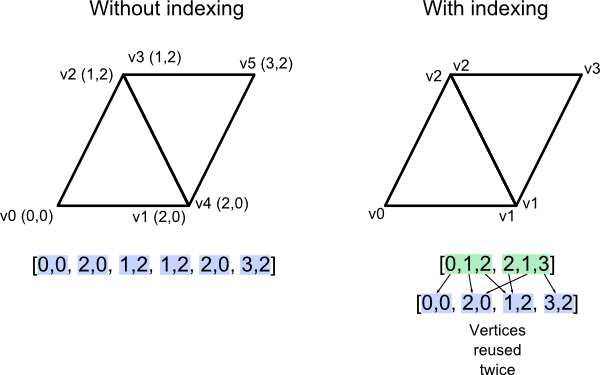
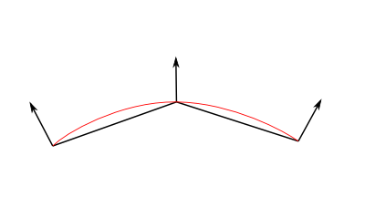
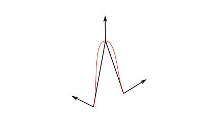
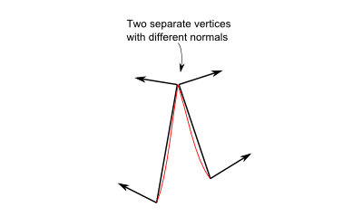

第九课：VBO索引
===

索引的原理
---
目前为止，建立VBO时我们总是重复存储一些共享的顶点和边。

本课将介绍索引技术。借助索引，我们可以重复使用一个顶点。这是用*索引缓冲区（index buffer）*来实现的。



索引缓冲区存储的是整数；每个三角形有三个整数索引，用索引就可以在各种*属性缓冲区*（顶点坐标、颜色、UV坐标、其他UV坐标、法向缓冲区等）中找到顶点的信息。这有点像OBJ文件格式，但有一点相差甚远：索引缓冲区只有一个。这意味着若两个三角形共用一个顶点，那这个顶点的所有属性对两个三角形来说都是一样的。

共享vs分开
---
来看看法向的例子。下图中，艺术家创建了两个三角形，试图模拟一个平滑曲面。可以把两个三角形的法向融合成一个顶点的法向。为方便观看，我画了一条红线表示平滑曲面。



然而在第二幅图中，美工想画的是“缝隙”或“边缘”。若融合了法向，就意味着色器会像前例一样进行平滑插值，生成一个平滑的表面：



因此在这种情况下，把顶点的法向分开存储反而更好；在OpenGL中，唯一实现方法是：把顶点连同其属性完整复制一份。



OpenGL中的索引VBO
---
索引的用法很简单。首先，需要创建一个额外的缓冲区存放索引。代码与之前一样，不过参数是`ELEMENT_ARRAY_BUFFER`，而非`ARRAY_BUFFER`。

```cpp
    std::vector<unsigned int> indices;
 
    // fill "indices" as needed
     
    // Generate a buffer for the indices
     GLuint elementbuffer;
     glGenBuffers(1, &elementbuffer);
     glBindBuffer(GL_ELEMENT_ARRAY_BUFFER, elementbuffer);
     glBufferData(GL_ELEMENT_ARRAY_BUFFER, indices.size() * sizeof(unsigned int), &indices[0], GL_STATIC_DRAW);
```

只需把`glDrawArrays`替换为如下语句，即可绘制模型：

```cpp
    // Index buffer
     glBindBuffer(GL_ELEMENT_ARRAY_BUFFER, elementbuffer);
     
     // Draw the triangles !
     glDrawElements(
         GL_TRIANGLES,      // mode
         indices.size(),    // count
         GL_UNSIGNED_INT,   // type
         (void*)0           // element array buffer offset
     );
```
（小提示：最好使用`unsigned short`，不要用`unsigned int`。这样更节省空间，速度也更快。）

填充索引缓冲区
---
现在遇到真正的问题了。如前所述，OpenGL只能使用一个索引缓冲区，而OBJ（及一些其他常用的3D格式，如Collada）每个属性都有一个索引缓冲区。这意味着，必须通过某种方式把若干个索引缓冲区合并成一个。

合并算法如下：

    For each input vertex
        Try to find a similar ( = same for all attributes ) vertex between all those we already output
        If found :
            A similar vertex is already in the VBO, use it instead !
        If not found :
            No similar vertex found, add it to the VBO


完整的C++代码位于`common/vboindexer.cpp`，注释很详尽。如果理解了以上算法，读懂代码应该没问题。

若两顶点的坐标、UV坐标和法线都相等，则认为两顶点是同一顶点。若还有其他属性，这一标准得酌情修改。

为了表述的简单，我们采用了蹩脚的线性查找来寻找相似顶点。实际中用`std::map`会更好。

补充：FPS计数器
---
虽然和索引没有直接关系，但现在去看看“FPS计数器”是很合适的——这样我们就能看到，索引究竟能提升多少性能。[“工具——调试器”](http://www.opengl-tutorial.org/miscellaneous/useful-tools-links/#header-4)中还有些其他和性能相关的工具。

