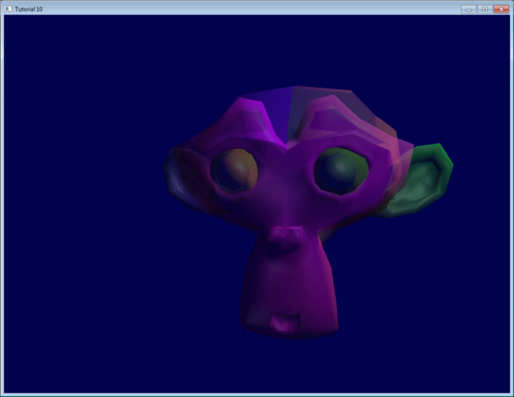
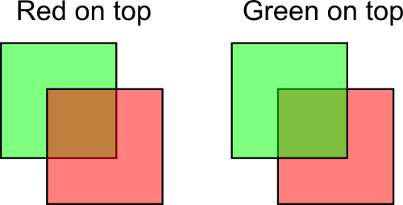
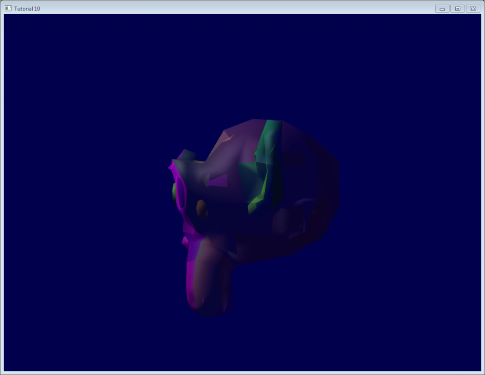

第十课：透明
===

alpha通道
---
alpha通道的概念很简单。之前是写RGB结果，现在改为写RGBA：
```cpp
    // Ouput data : it's now a vec4
    out vec4 color;
```
前三个分量仍可以通过混合操作符（swizzle operator）.xyz访问，最后一个分量通过.a访问：
```cpp
    color.a = 0.3;
```
不太直观，但alpha = 不透明度；因此alpha = 1代表完全不透明，alpha = 0为完全透明。


这里我们简单地将alpha硬编码为0.3；但更常见的做法是用一个uniform变量表示它，或从RGBA纹理中读取（TGA格式支持alpha通道，而GLFW支持TGA）。

结果如下。既然我们能“看透”模型表面，请确保关闭隐面消除（`glDisable(GL_CULL_FACE) `）。否则就发现模型没有了“背”面。


顺序很重要！
---
上一个截图看上去还行，但这仅仅是运气好罢了。

###问题所在###
这里我画了一红一绿两个alpha值为50%的正方形。从中可以看出顺序的重要性，最终的颜色显著影响了眼睛对深度的感知。



我们的场景中也出现了同样的现象。试着稍稍改变一下视角：



事实证明这个问题十分棘手。游戏中透明的东西不多，对吧？

###常见解决方案###

常见解决方案即对所有的透明三角形排序。是的，所有的透明三角形。

- 绘制场景的不透明部分，让深度缓冲区能丢弃被遮挡的透明三角形。
- 对透明三角形按深度从近到远排序。
- 绘制透明三角形。

可以用C语言的`qsort`函数或者C++的`std::sort`函数来排序。细节就不多说了，因为……

###警告###

这么做可以解决问题（下一节还会介绍它），但：

- 填充速率会被限制，即，每个片断会写10、20次，也许更多。这对力不从心的内存总线来说太沉重了。通常，深度缓冲区可以自动丢弃“远”片断；但这时，我们显式地对片断进行排序，故深度缓冲区实际上没发挥作用。
- 这些操作，每个像素上都会做4遍（我们用了4倍多重采样抗锯齿（MSAA）），除非用了什么高明的优化。
- 透明三角形排序很耗时
- 若要逐个三角形地切换纹理，或者更糟糕地，要切换着色器——性能会大打折扣。别这么干。

一个足够好的解决方案是：

- 限制透明多边形的数量
- 对所有透明多边形使用同一个着色器和纹理
- 若这些透明多边形必须看起来很不同，请用纹理区分！
- 若不排序，效果也还行，那最好别排序。

###顺序无关透明
如果你的引擎确实需要顶尖的透明效果，这有一些技术值得研究一番：

- [2001年Depth Peeling论文](http://citeseerx.ist.psu.edu/viewdoc/download?doi=10.1.1.18.9286&rep=rep1&type=pdf)：像素级精细度，但速度不快
- <del>[Dual Depth Peeling](http://developer.download.nvidia.com/SDK/10/opengl/src/dual_depth_peeling/doc/DualDepthPeeling.pdf)</del>：小幅改进
- 桶排序相关的几篇论文。把fragment存到数组，在shader中进行深度排序。
- [ATI Mecha Demo](http://fr.slideshare.net/hgruen/oit-and-indirect-illumination-using-dx11-linked-lists)：又好又快，但实现起来有难度，需要最新的硬件。用链表存储fragment。
- [Cyril Crassin实现的ATI Mecha](http://blog.icare3d.org/2010/07/opengl-40-abuffer-v20-linked-lists-of.html)：实现难度更大

注意，即便是《小小大星球》（*Little Big Planet*）这种最新的端游，也只用了一层透明。

混合函数
---
要让之前的代码运行，得设置好混合函数。In order for the previous code to work, you need to setup your blend function.
```cpp
    // Enable blending
    glEnable(GL_BLEND);
    glBlendFunc(GL_SRC_ALPHA, GL_ONE_MINUS_SRC_ALPHA);
```
这意味着

    New color in framebuffer = 
               current alpha in framebuffer * current color in framebuffer + 
               (1 - current alpha in framebuffer) * shader's output color
               
前文所述红色方块居上的例子中：

    new color = 0.5*(0,1,0) + (1-0.5)*(1,0.5,0.5); // (the red was already blended with the white background)
    new color = (1, 0.75, 0.25) = the same orange


