第十六课：阴影贴图（Shadow mapping）
===

第十五课中已经学习了如何创建光照贴图。光照贴图可用于静态对象的光照，其阴影效果也很不错，但无法处理运动的对象。

阴影贴图是目前（截止2012年）最好的生成动态阴影的方法。此法最大的优点是易于实现，缺点是想完全**正确**地实现不大容易。

本课首先介绍基本算法，探究其缺陷，然后实现一些优化。由于撰写本文时（2012），阴影贴图技术还在被广泛地研究；我们将提供一些指导，以便你根据自身需要，进一步改善你的阴影贴图。

基本的阴影贴图
---
基本的阴影贴图算法包含两个步骤。首先，从光源的视角将场景渲染一次，只计算每个片断的深度。接着从正常的视角把场景再渲染一次，渲染时要测试当前片断是否位于阴影中。

“是否在阴影中”的测试实际上非常简单。如果当前采样点比阴影贴图中的同一点离光源更远，那说明场景中有一个物体比当前采样点离光源更近；即当前片断位于阴影中。


下图可以帮你理解上述原理：

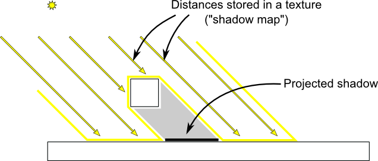

###渲染阴影贴图###
本课只考虑平行光——一种位于无限远处，其光线可视为相互平行的光源。故可用正交投影矩阵来渲染阴影贴图。正交投影矩阵和一般的透视投影矩阵差不多，只不过未考虑透视——因此无论距离相机多远，物体的大小看起来都是一样的。

###设置渲染目标和MVP矩阵###
十四课中，大家学习了把场景渲染到纹理，以便稍后从shader中访问的方法。 

这里采用了一幅1024x1024、16位深度的纹理来存储阴影贴图。对于阴影贴图来说，通常16位绰绰有余;你可以自由地试试别的数值。注意，这里采用的是深度纹理，而非深度渲染缓冲区（这个要留到后面进行采样）。

```cpp
// The framebuffer, which regroups 0, 1, or more textures, and 0 or 1 depth buffer.
 GLuint FramebufferName = 0;
 glGenFramebuffers(1, &FramebufferName);
 glBindFramebuffer(GL_FRAMEBUFFER, FramebufferName);

 // Depth texture. Slower than a depth buffer, but you can sample it later in your shader
 GLuint depthTexture;
 glGenTextures(1, &depthTexture);
 glBindTexture(GL_TEXTURE_2D, depthTexture);
 glTexImage2D(GL_TEXTURE_2D, 0,GL_DEPTH_COMPONENT16, 1024, 1024, 0,GL_DEPTH_COMPONENT, GL_FLOAT, 0);
 glTexParameteri(GL_TEXTURE_2D, GL_TEXTURE_MAG_FILTER, GL_NEAREST);
 glTexParameteri(GL_TEXTURE_2D, GL_TEXTURE_MIN_FILTER, GL_NEAREST);
 glTexParameteri(GL_TEXTURE_2D, GL_TEXTURE_WRAP_S, GL_CLAMP_TO_EDGE);
 glTexParameteri(GL_TEXTURE_2D, GL_TEXTURE_WRAP_T, GL_CLAMP_TO_EDGE);

 glFramebufferTexture(GL_FRAMEBUFFER, GL_DEPTH_ATTACHMENT, depthTexture, 0);

 glDrawBuffer(GL_NONE); // No color buffer is drawn to.

 // Always check that our framebuffer is ok
 if(glCheckFramebufferStatus(GL_FRAMEBUFFER) != GL_FRAMEBUFFER_COMPLETE)
 return false;
```
MVP矩阵用于从光源的视角绘制场景，其计算过程如下：

* 投影矩阵是正交矩阵，可将整个场景包含到一个AABB（axis-aligned box, 轴向包围盒）里，该包围盒在X、Y、Z轴上的坐标范围分别为(-10,10)、(-10,10)、(-10,20)。这样做是为了让整个场景始终可见，这一点在“再进一步”小节还会讲到。
* 视图矩阵对场景做了旋转，这样在观察坐标系中，光源的方向就是-Z方向（需要温习[第三课]
* 模型矩阵可设为任意值。
```cpp
glm::vec3 lightInvDir = glm::vec3(0.5f,2,2);

 // Compute the MVP matrix from the light's point of view
 glm::mat4 depthProjectionMatrix = glm::ortho<float>(-10,10,-10,10,-10,20);
 glm::mat4 depthViewMatrix = glm::lookAt(lightInvDir, glm::vec3(0,0,0), glm::vec3(0,1,0));
 glm::mat4 depthModelMatrix = glm::mat4(1.0);
 glm::mat4 depthMVP = depthProjectionMatrix * depthViewMatrix * depthModelMatrix;

 // Send our transformation to the currently bound shader,
 // in the "MVP" uniform
 glUniformMatrix4fv(depthMatrixID, 1, GL_FALSE, &depthMVP[0][0])
```
###Shaders###
这一次渲染中所用的着色器很简单。顶点着色器仅仅简单地计算一下顶点的齐次坐标：

```glsl
#version 330 core

// Input vertex data, different for all executions of this shader.
layout(location = 0) in vec3 vertexPosition_modelspace;

// Values that stay constant for the whole mesh.
uniform mat4 depthMVP;

void main(){
 gl_Position =  depthMVP * vec4(vertexPosition_modelspace,1);
}
```

fragment shader同样简单：只需将片断的深度值写到location 0（即写入深度纹理）。

```glsl
#version 330 core

// Ouput data
layout(location = 0) out float fragmentdepth;

void main(){
    // Not really needed, OpenGL does it anyway
    fragmentdepth = gl_FragCoord.z;
}
```
渲染阴影贴图比渲染一般的场景要快一倍多，因为只需写入低精度的深度值，不需要同时写深度值和颜色值。显存带宽往往是影响GPU性能的关键因素。

###结果###
渲染出的纹理如下所示：

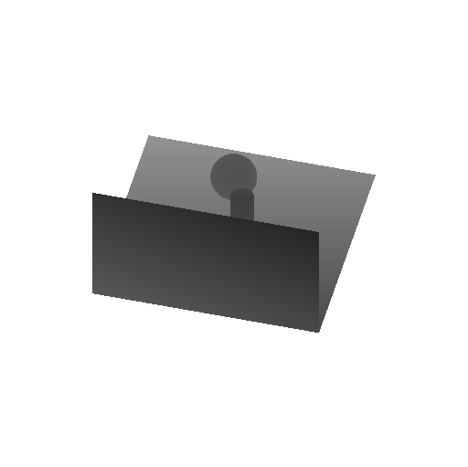

颜色越深表示z值越小；故墙面的右上角离相机更近。相反地，白色表示z=1（齐次坐标系中的值），离相机十分遥远。

使用阴影贴图
---
###基本shader###
现在回到普通的着色器。对于每一个计算出的fragment，都要测试其是否位于阴影贴图之“后”。

为了做这个测试，需要计算：**在创建阴影贴图所用的坐标系中**，当前片断的坐标。因此要依次用通常的`MVP`矩阵和`depthMVP`矩阵对其做变换。

不过还需要一些技巧。将depthMVP与顶点坐标相乘得到的是齐次坐标，坐标范围为[-1,1]，而纹理采样的取值范围却是[0,1]。

举个例子，位于屏幕中央的fragment的齐次坐标应该是(0,0)；但要对纹理中心进行采样，UV坐标就应该是(0.5,0.5)。

这个问题可以通过在片断着色器中调整采样坐标来修正，但用下面这个矩阵去乘齐次坐标则更为高效。这个矩阵将坐标除以2（主对角线上[-1,1] -> [-0.5, 0.5]），然后平移（最后一行[-0.5, 0.5] -> [0,1]）。

```cpp
glm::mat4 biasMatrix(
0.5, 0.0, 0.0, 0.0,
0.0, 0.5, 0.0, 0.0,
0.0, 0.0, 0.5, 0.0,
0.5, 0.5, 0.5, 1.0
);
glm::mat4 depthBiasMVP = biasMatrix*depthMVP;
```
终于可以写vertex shader了。和之前的差不多，不过这次要输出两个坐标。

* `gl_Position`是当前相机所在坐标系下的顶点坐标
* `ShadowCoord`是上一个相机（光源）所在坐标系下的顶点坐标

```glsl
// Output position of the vertex, in clip space : MVP * position
gl_Position =  MVP * vec4(vertexPosition_modelspace,1);

// Same, but with the light's view matrix
ShadowCoord = DepthBiasMVP * vec4(vertexPosition_modelspace,1);
```
fragment shader就很简单了：

* `texture2D( shadowMap, ShadowCoord.xy ).z` 是光源到距离最近的遮挡物之间的距离。
* `ShadowCoord.z`是光源和当前片断之间的距离

……因此，若当前fragment比最近的遮挡物还远，那意味着这个片断位于（这个最近的遮挡物的）阴影中
```glsl
float visibility = 1.0;
if ( texture2D( shadowMap, ShadowCoord.xy ).z  <  ShadowCoord.z){
visibility = 0.5;
}
```
我们只需把这个原理加到光照计算中。当然，环境光分量无需改动，毕竟这只分量是个为了模拟一些光亮，让即使处在阴影或黑暗中的物体也能显出轮廓来（否则就会是纯黑色）。

```glsl
color =
 // Ambiant : simulates indirect lighting
 MaterialAmbiantColor +
 // Diffuse : "color" of the object
 visibility * MaterialDiffuseColor * LightColor * LightPower * cosTheta+
 // Specular : reflective highlight, like a mirror
 visibility * MaterialSpecularColor * LightColor * LightPower * pow(cosAlpha,5);
```
###结果——阴影瑕疵（Shadow acne）###

这是目前的代码渲染的结果。很明显，大体的思想是实现了，不过质量不尽如人意。

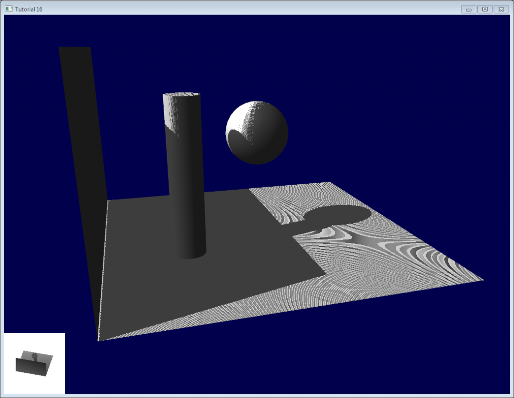

逐一检查图中的问题。代码有两个工程：`shadowmaps`和`shadowmaps_simple`，任选一项。simple版的效果和上图一样糟糕，但代码比较容易理解。

问题
---
###阴影瑕疵###
最明显的问题就是**阴影瑕疵**：

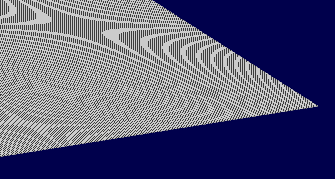

这种现象可用下面这张简单的图解释：

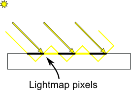

通常的“补救措施”是加上一个误差容限（error margin）：仅当当前fragment的深度（再次提醒，这里指的是从光源的坐标系得到的深度值）确实比光照贴图像素的深度要大时，才将其判定为阴影。这可以通过添加一个偏差（bias）来办到：

```glsl
float bias = 0.005;
float visibility = 1.0;
if ( texture2D( shadowMap, ShadowCoord.xy ).z  <  ShadowCoord.z-bias){
visibility = 0.5;
}
```
效果好多了：:

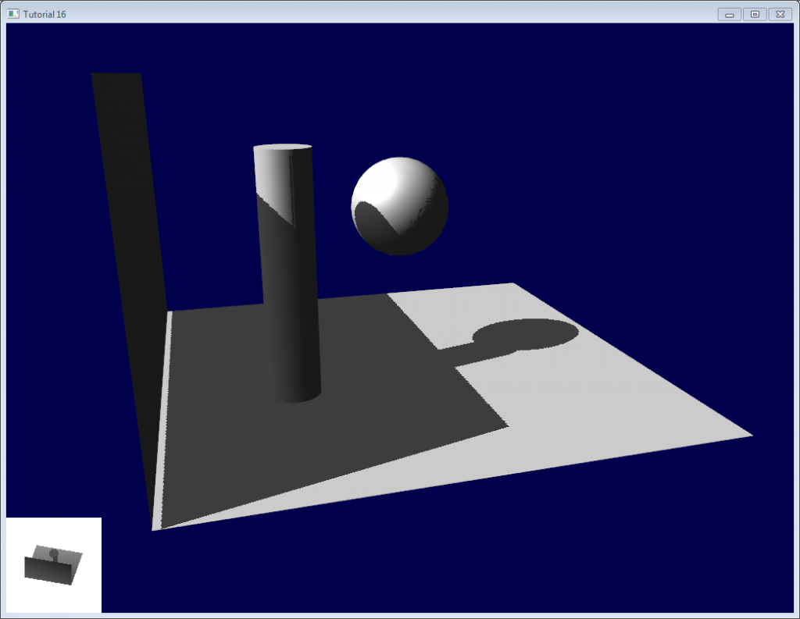

不过，您也许注意到了，由于加入了偏差，墙面与地面之间的瑕疵显得更加明显了。更糟糕的是，0.005的偏差对地面来说太大了，但对曲面来说又太小了：圆柱体和球体上的瑕疵依然可见。

一个通常的解决方案是根据斜率调整偏差：

```glsl
float bias = 0.005*tan(acos(cosTheta)); // cosTheta is dot( n,l ), clamped between 0 and 1
bias = clamp(bias, 0,0.01);
```
阴影瑕疵消失了，即使在曲面上也看不到了。


还有一个技巧，不过这个技巧灵不灵得看具体的几何形状。此技巧只渲染阴影中的背面。这就对厚墙的几何形状提出了硬性要求（请看下一节——阴影悬空（Peter Panning），不过即使有瑕疵，也只会出现在阴影遮蔽下的表面上。【译者注：在迪斯尼经典动画[《小飞侠》](http://movie.douban.com/subject/1296538/)中，小飞侠彼得·潘的影子和身体分开了，小仙女温蒂又给他缝好了。】

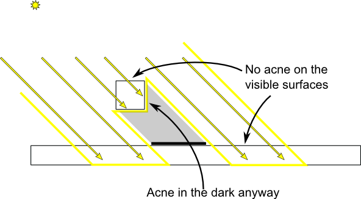

渲染阴影贴图时剔除正面的三角形：

```cpp
    // We don't use bias in the shader, but instead we draw back faces,
    // which are already separated from the front faces by a small distance
    // (if your geometry is made this way)
    glCullFace(GL_FRONT); // Cull front-facing triangles -> draw only back-facing triangles
```
渲染场景时正常地渲染（剔除背面）

```cpp
    glCullFace(GL_BACK); // Cull back-facing triangles -> draw only front-facing triangles
```
代码中也用了这个方法，和“加入偏差”联合使用。

###阴影悬空（Peter Panning）###
现在没有阴影瑕疵了，但地面的光照效果还是不对，看上去墙面好像悬在半空（因此术语称为“阴影悬空”）。实际上，加上偏差会加剧阴影悬空。

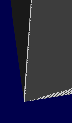

这个问题很好修正：避免使用薄的几何形体就行了。这样做有两个好处：

* 首先，（把物体增厚）解决了阴影悬空问题：物体比偏差值要大得多，于是一切麻烦烟消云散了
* 其次，可在渲染光照贴图时启用背面剔除，因为现在，墙壁上有一个面面对光源，就可以遮挡住墙壁的另一面，而这另一面恰好作为背面被剔除了，无需渲染。

缺点就是要渲染的三角形增多了（每帧多了一倍的三角形！）

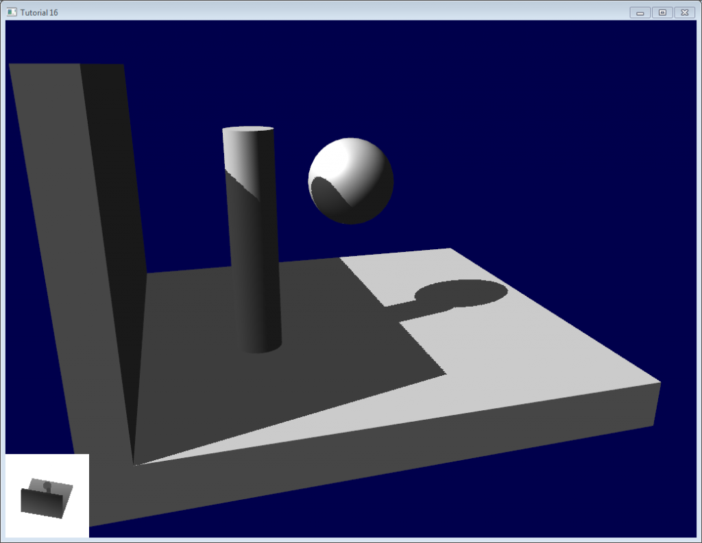

###走样###
即使是使用了这些技巧，你还是会发现阴影的边缘上有一些走样。换句话说，就是一个像素点是白的，邻近的一个像素点是黑的，中间缺少平滑过渡。


###PCF（percentage closer filtering，百分比渐近滤波）###
一个最简单的改善方法是把阴影贴图的`sampler`类型改为**`sampler2DShadow`**。这么做的结果是，每当对阴影贴图进行一次采样时，硬件就会对相邻的纹素进行采样，并对它们全部进行比较，对比较的结果做双线性滤波后返回一个[0,1]之间的float值。

例如，0.5即表示有两个采样点在阴影中，两个采样点在光明中。

注意，它和对滤波后深度图做单次采样有区别！一次“比较”，返回的是true或false；PCF返回的是4个“true或false”值的插值结果

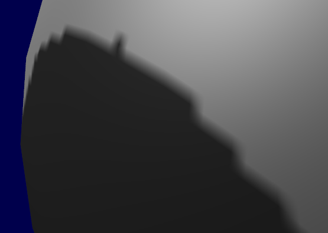

可以看到，阴影边界平滑了，但阴影贴图的纹素依然可见。

###泊松采样（Poisson Sampling）###
一个简易的解决办法是对阴影贴图做N次采样（而不是只做一次）。并且要和PCF一起使用，这样即使采样次数不多，也可以得到较好的效果。下面是四次采样的代码：

```glsl
for (int i=0;i<4;i++){
  if ( texture2D( shadowMap, ShadowCoord.xy + poissonDisk[i]/700.0 ).z  <  ShadowCoord.z-bias ){
    visibility-=0.2;
  }
}
```
`poissonDisk`是一个常量数组，其定义看起来像这样：

```glsl
vec2 poissonDisk[4] = vec2[](
  vec2( -0.94201624, -0.39906216 ),
  vec2( 0.94558609, -0.76890725 ),
  vec2( -0.094184101, -0.92938870 ),
  vec2( 0.34495938, 0.29387760 )
);
```
这样，根据阴影贴图采样点个数的多少，生成的fragment会随之变明或变暗。


常量700.0确定了采样点的“分散”程度。散得太密，还是会发生走样；散得太开，会出现**条带**（截图中未使用PCF，以便让条带现象更明显；其中做了16次采样）

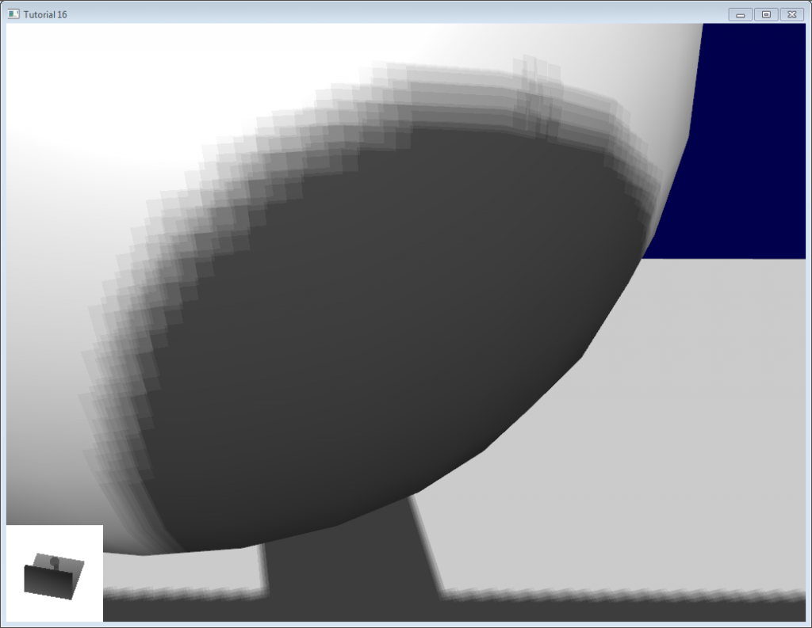


###分层泊松采样（Stratified Poisson Sampling）###
通过为每个像素分配不同采样点个数，我们可以消除这一问题。主要有两种方法：分层泊松法（Stratified Poisson）和旋转泊松法（Rotated Poisson）。分层泊松法选择不同的采样点数；旋转泊松法采样点数保持一致，但会做随机的旋转以使采样点的分布发生变化。本课仅对分层泊松法作介绍。

与之前版本唯一不同的是，这里用了一个随机数来索引`poissonDisk`：
```glsl
    for (int i=0;i<4;i++) {
    int index = // A random number between 0 and 15, different for each pixel (and each i !)
    visibility -= 0.2*(1.0-texture( shadowMap, vec3(ShadowCoord.xy + poissonDisk[index]/700.0,  (ShadowCoord.z-bias)/ShadowCoord.w) ));
    }
```
可用如下代码（返回一个[0,1]间的随机数）产生随机数

```glsl
    float dot_product = dot(seed4, vec4(12.9898,78.233,45.164,94.673));
    return fract(sin(dot_product) * 43758.5453);
```
本例中，`seed4`是参数`i`和`seed`的组成的vec4向量（这样才会是在4个位置做采样）。参数seed的值可以选用`gl_FragCoord`（像素的屏幕坐标），或者`Position_worldspace`：
```cpp
         //  - A random sample, based on the pixel's screen location.
        //    No banding, but the shadow moves with the camera, which looks weird.
        int index = int(16.0*random(gl_FragCoord.xyy, i))%16;
        //  - A random sample, based on the pixel's position in world space.
        //    The position is rounded to the millimeter to avoid too much aliasing
        //int index = int(16.0*random(floor(Position_worldspace.xyz*1000.0), i))%16;
```
这样做之后，上图中的那种条带就消失了，不过噪点却显现出来了。不过，一些“漂亮的”噪点可比上面那些条带“好看”多了。

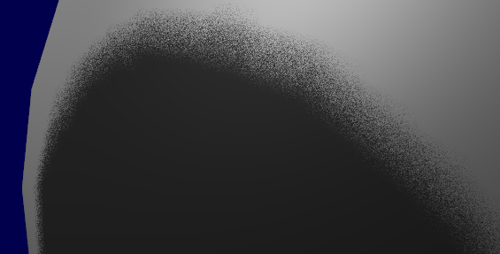

上述三个例子的实现请参见tutorial16/ShadowMapping.fragmentshader。

深入研究
---
即使把这些技巧都用上，仍有很多方法可以提升阴影质量。下面是最常见的一些方法：

###早优化（Early bailing）###
不要把采样次数设为16，太大了，四次采样足矣。若这四个点都在光明或都在阴影中，那就算做16次采样效果也一样：这就叫过早优化。若这些采样点明暗各异，那你很可能位于阴影边界上，这时候进行16次采样才是合情理的。

###聚光灯（Spot lights）###
处理聚光灯这种光源时，不需要多大的改动。最主要的是：把正交投影矩阵换成透视投影矩阵：

```cpp
glm::vec3 lightPos(5, 20, 20);
glm::mat4 depthProjectionMatrix = glm::perspective<float>(45.0f, 1.0f, 2.0f, 50.0f);
glm::mat4 depthViewMatrix = glm::lookAt(lightPos, lightPos-lightInvDir, glm::vec3(0,1,0));
```

大部分都一样，只不过用的不是正交视域四棱锥，而是透视视域四棱锥。考虑到透视除法，采用了texture2Dproj。（见“第四课——矩阵”的脚注）

第二步，在shader中，把透视考虑在内。（见“第四课——矩阵”的脚注。简而言之，透视投影矩阵根本就没做什么透视。这一步是由硬件完成的，只是把投影的坐标除以了w。这里在着色器中模拟这一步操作，因此得自己做透视除法。顺便说一句，正交矩阵产生的齐次向量w始终为1，这就是为什么正交矩阵没有任何透视效果。）

用GLSL完成此操作主要有两种方法。第二种方法利用了内置的`textureProj`函数，但两种方法得出的效果是一样的。

```glsl
if ( texture( shadowMap, (ShadowCoord.xy/ShadowCoord.w) ).z  <  (ShadowCoord.z-bias)/ShadowCoord.w )
if ( textureProj( shadowMap, ShadowCoord.xyw ).z  <  (ShadowCoord.z-bias)/ShadowCoord.w )
```

###点光源（Point lights）###
大部分是一样的，不过要做深度立方体贴图（cubemap）。立方体贴图包含一组6个纹理，每个纹理位于立方体的一面，无法用标准的UV坐标访问，只能用一个代表方向的三维向量来访问。

空间各个方向的深度都保存着，保证点光源各方向都能投射影子。T

###多个光源组合###
该算法可以处理多个光源，但别忘了，每个光源都要做一次渲染，以生成其阴影贴图。这些计算极大地消耗了显存，也许很快你的显卡带宽就吃紧了。

###自动光源四棱锥（Automatic light frustum）###
本课中，囊括整个场景的光源四棱锥是手动算出来的。虽然在本课的限定条件下，这么做还行得通，但应该避免这样的做法。如果你的地图大小是1Km x 1Km，你的阴影贴图大小为1024x1024，则每个纹素代表的面积为1平方米。这么做太蹩脚了。光源的投影矩阵应尽量紧包整个场景。

对于聚光灯来说，只需调整一下范围就行了。

对于太阳这样的方向光源，情况就复杂一些：光源**确实**照亮了整个场景。以下是计算方向光源视域四棱锥的一种方法：

潜在阴影接收者（Potential Shadow Receiver，PSR）。PSR是这样一种物体——它们同时在【光源视域四棱锥，观察视域四棱锥，以及场景包围盒】这三者之内。顾名思义，PSR都有可能位于阴影中：相机和光源都能“看”到它。

潜在阴影投射者（Potential Shadow Caster，PSC）= PSR + 所有位于PSR和光源之间的物体（一个物体可能不可见但仍然会投射出一条可见的阴影）。

因此，要计算光源的投影矩阵，可以用所有可见的物体，“减去”那些离得太远的物体，再计算其包围盒；然后“加上”位于包围盒与广元之间的物体，再次计算新的包围盒（不过这次是沿着光源的方向）。

这些集合的精确计算涉及凸包体的求交计算，但这个方法(计算包围盒)实现起来简单多了。

此法在物体离开视域四棱锥时，计算量会陡增，原因在于阴影贴图的分辨率陡然增加了。你可以通过多次平滑插值来弥补。CSM（Cascaded Shadow Map，层叠阴影贴图法）无此问题，但实现起来较难。

###指数阴影贴图（Exponential shadow map）###
指数阴影贴图法试图借助“位于阴影中的、但离光源较近的片断实际上处于‘某个中间位置’”这一假设来减少走样。这个方法涉及到偏差，不过测试已不再是二元的：片断离明亮曲面的距离越远，则其越显得黑暗。

显然，这纯粹是一种障眼法，两物体重叠时，瑕疵就会显露出来。

###LiSPSM（Light-space perspective Shadow Map，光源空间透视阴影贴图）###
LiSPSM调整了光源投影矩阵，从而在离相机很近时获取更高的精度。这一点在“duelling frustra”现象发生时显得尤为重要。所谓“duelling frustra”是指：点光源与你（相机）距离远，『视线』方向又恰好与你的视线方向相反。离光源近的地方(即离你远的地方)，阴影贴图精度高；离光源远的地方（即离你近的地方，你最需要精确阴影贴图的地方），阴影贴图的精度又不够了。

不过LiSPSM实现起来很难。详细的实现方法请看参考文献。

CSM（Cascaded shadow map，层叠阴影贴图）
CSM和LiSPSM解决的问题一模一样，但方式不同。CSM仅对观察视域四棱锥的各部分使用了2~4个标准阴影贴图。第一个阴影贴图处理近处的物体，所以在近处这块小区域内，你可以获得很高的精度。随后几个阴影贴图处理远一些的物体。最后一个阴影贴图处理场景中的很大一部分，但由于透视效应，视觉感官上没有近处区域那么明显。

撰写本文时，CSM是复杂度/质量比最好的方法。很多案例都选用了这一解决方案。

总结
---
正如您所看到的，阴影贴图技术是个很复杂的课题。每年都有新的方法和改进方案发表。但目前为止尚无完美的解决方案。

幸运的是，大部分方法都可以混合使用：在LiSPSM中使用CSM，再加PCF平滑等等是完全可行的。尽情地实验吧。

总结一句，我建议您坚持尽可能使用预计算的光照贴图，只为动态物体使用阴影贴图。并且要确保两者的视觉效果协调一致，任何一者效果太好/太坏都不合适。


