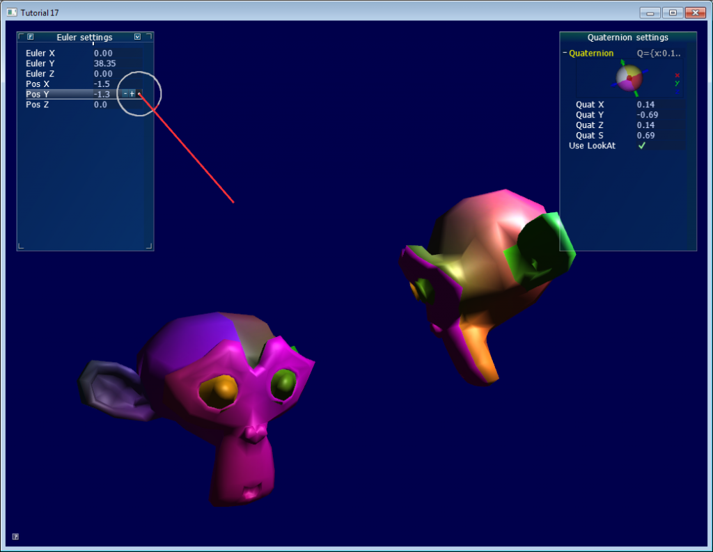

免责申明（必读！）：本网站提供的所有教程的翻译原稿均来自于互联网，仅供学习交流之用，切勿进行商业传播。同时，转载时不要移除本申明。如产生任何纠纷，均与本博客所有人、发表该翻译稿之人无任何关系。谢谢合作！

原文链接：[http://www.opengl-tutorial.org/intermediate-tutorials/tutorial-12-opengl-extensions/](http://www.opengl-tutorial.org/intermediate-tutorials/tutorial-12-opengl-extensions/)

原译文链接: [http://www.opengl-tutorial.org/zh-hans/intermediate-tutorials-zh/tutorial-12-opengl-extensions-zh/](http://www.opengl-tutorial.org/zh-hans/intermediate-tutorials-zh/tutorial-12-opengl-extensions-zh/)

##第十七课：旋转

虽然本课有些超出OpenGL的范围，但是解决了一个常见问题：怎样表示旋转？

《第三课：矩阵》中，我们了解到矩阵可以让点绕某个轴旋转。矩阵可以简洁地表示顶点的变换，但使用难度较大：例如，从最终结果中获取旋转轴就很麻烦。

本课将展示两种最常见的表示旋转的方法：欧拉角（Euler angles）和四元数（Quaternion）。最重要的是，本课将详细解释为何要尽量使用四元数。

 

### 旋转与朝向（orientation）

阅读有关旋转的文献时，你可能会为其中的术语感到困惑。本课中：

- “朝向”是状态：该物体的朝向为……

- “旋转”是操作：旋转该物体
